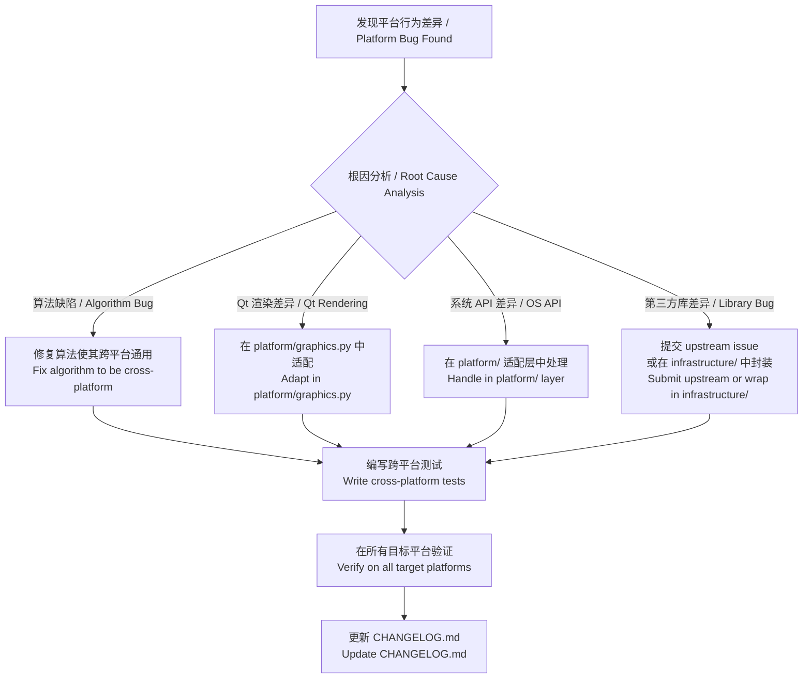

# 🌐 跨平台架构约定 / Cross-Platform Architecture Conventions

> 本文档为 iPhoton 项目在多操作系统（Windows、Linux、macOS 等）环境下的行为差异修复与平台特定代码编写定义统一的架构约定。

---

## 目录 / Table of Contents

1. [核心原则 / Core Principles](#核心原则--core-principles)
2. [分层架构模型 / Layered Architecture Model](#分层架构模型--layered-architecture-model)
3. [平台适配层设计 / Platform Adaptation Layer](#平台适配层设计--platform-adaptation-layer)
4. [平台特定代码编写规范 / When to Write Platform-Specific Code](#平台特定代码编写规范--when-to-write-platform-specific-code)
5. [禁止事项 / What Is Prohibited](#禁止事项--what-is-prohibited)
6. [Bug 修复流程 / Bug Fix Workflow](#bug-修复流程--bug-fix-workflow)
7. [平台适配实施指南 / Implementation Guide](#平台适配实施指南--implementation-guide)
8. [测试策略 / Testing Strategy](#测试策略--testing-strategy)
9. [现有平台特定代码审计 / Existing Platform Code Audit](#现有平台特定代码审计--existing-platform-code-audit)

---

## 核心原则 / Core Principles

### 1. 业务逻辑零平台感知 / Zero Platform Awareness in Business Logic

业务逻辑（`core/`、`application/`、`domain/`）**绝不允许**包含平台条件判断代码。
这些层应该是纯粹的、可测试的、与操作系统无关的代码。

> Business logic in `core/`, `application/`, and `domain/` layers **must never** contain
> platform-conditional code. These layers must remain pure, testable, and OS-agnostic.

### 2. 平台差异封装到适配层 / Encapsulate Platform Differences in Adaptation Layers

所有 `if sys.platform == ...` 或 `if os.name == ...` 形式的代码只能出现在
**专门的平台适配模块**中，不得散落在业务代码的各个角落。

> All `if sys.platform` or `if os.name` checks must live in **dedicated platform
> adaptation modules**, never scattered across business code.

### 3. 接口优于条件分支 / Interfaces Over Conditionals

优先通过抽象接口 + 工厂模式来处理平台差异，而非在代码中直插 `if/else` 分支。

> Prefer abstract interfaces + factory patterns to handle platform differences rather
> than inline `if/else` branches.

---

## 分层架构模型 / Layered Architecture Model

```
┌─────────────────────────────────────────────────────────────────┐
│                         表示层 / GUI Layer                       │
│    (PySide6 Widgets, ViewModels, Coordinators)                  │
│                                                                 │
│    ⚠️ 允许通过平台适配层间接使用平台特定逻辑                        │
│    ⚠️ Platform-specific logic allowed via adaptation layer only  │
├─────────────────────────────────────────────────────────────────┤
│                      应用层 / Application Layer                  │
│    (Use Cases, Services, DTOs)                                  │
│                                                                 │
│    ❌ 禁止平台条件代码 / No platform conditionals                 │
├─────────────────────────────────────────────────────────────────┤
│                      领域层 / Domain Layer                       │
│    (Models, Value Objects, Domain Events)                       │
│                                                                 │
│    ❌ 禁止平台条件代码 / No platform conditionals                 │
├─────────────────────────────────────────────────────────────────┤
│                      核心层 / Core Layer                         │
│    (Pairing, Classification, RAW Processing)                    │
│                                                                 │
│    ❌ 禁止平台条件代码 / No platform conditionals                 │
├─────────────────────────────────────────────────────────────────┤
│                  基础设施层 / Infrastructure Layer                │
│    (Repositories, File System, External Services)               │
│                                                                 │
│    ⚠️ 允许通过平台适配层间接使用平台特定逻辑                        │
├─────────────────────────────────────────────────────────────────┤
│               ✅ 平台适配层 / Platform Adaptation Layer           │
│    (OS-specific implementations, Qt backend selection)          │
│                                                                 │
│    ✅ 唯一允许 if os.name / sys.platform 的地方                   │
│    ✅ The ONLY place where platform checks are allowed           │
└─────────────────────────────────────────────────────────────────┘
```

---

## 平台适配层设计 / Platform Adaptation Layer

### 目录结构 / Directory Structure

```
src/iPhoto/platform/
├── __init__.py            # 对外暴露统一接口 / Public unified API
├── _detect.py             # 平台检测工具 / Platform detection utilities
├── _base.py               # 抽象基类 / Abstract base classes
├── _windows.py            # Windows 实现 / Windows implementations
├── _linux.py              # Linux 实现 / Linux implementations
├── _macos.py              # macOS 实现 / macOS implementations
├── graphics.py            # 图形渲染适配 / Graphics rendering adaptation
├── subprocess_utils.py    # 子进程管理适配 / Subprocess management
├── paths.py               # 路径与文件系统适配 / Path & filesystem adaptation
└── fonts.py               # 字体与图标渲染适配 / Font & icon rendering
```

### `_detect.py` — 平台检测核心 / Platform Detection Core

```python
"""Centralized platform detection — the single source of truth."""

import sys
from enum import Enum, auto


class Platform(Enum):
    WINDOWS = auto()
    LINUX = auto()
    MACOS = auto()


def current_platform() -> Platform:
    if sys.platform == "win32":
        return Platform.WINDOWS
    elif sys.platform == "darwin":
        return Platform.MACOS
    else:
        return Platform.LINUX
```

### `__init__.py` — 统一对外接口 / Unified Public API

```python
"""Platform adaptation layer — unified API for all OS-specific behavior."""

from ._detect import Platform, current_platform

# 通过工厂函数按需创建平台特定实例
# Create platform-specific instances via factory functions
def create_subprocess_helper():
    """Return the appropriate subprocess helper for the current OS."""
    ...

def create_graphics_adapter():
    """Return the appropriate graphics adapter for the current OS."""
    ...
```

### 使用示例 / Usage Example

```python
# ❌ 错误 — 在业务代码中直接判断平台
# ❌ WRONG — Platform check in business code
import os
class ThumbnailService:
    def generate(self, path):
        if os.name == "nt":
            # Windows-specific thumbnail generation
            ...
        else:
            # Linux/macOS thumbnail generation
            ...

# ✅ 正确 — 通过平台适配层
# ✅ CORRECT — Via platform adaptation layer
from iPhoto.platform import create_graphics_adapter

class ThumbnailService:
    def __init__(self):
        self._graphics = create_graphics_adapter()

    def generate(self, path):
        return self._graphics.generate_thumbnail(path)
```

---

## 平台特定代码编写规范 / When to Write Platform-Specific Code

### ✅ 允许使用平台条件代码的场景 / Allowed Scenarios

| 层级 / Layer | 场景 / Scenario | 示例 / Example |
|---|---|---|
| **平台适配层** `platform/` | 任何平台差异 | 所有 `if sys.platform` 代码 |
| **基础设施层** `infrastructure/` | 子进程创建标志 | `subprocess.CREATE_NO_WINDOW` on Windows |
| **基础设施层** `infrastructure/` | 系统路径约定 | 配置文件目录（`%APPDATA%` vs `~/.config`） |
| **设置层** `settings/` | 默认路径 | 平台相关的默认存储路径 |
| **GUI 工具层** `gui/utils/` | 渲染后端选择 | OpenGL 初始化策略 |

### ❌ 禁止使用平台条件代码的场景 / Prohibited Scenarios

| 层级 / Layer | 原因 / Reason |
|---|---|
| `core/` | 核心算法必须平台无关 |
| `application/use_cases/` | 用例逻辑是业务行为，不是系统行为 |
| `domain/models/` | 领域模型是纯数据结构 |
| `gui/viewmodels/` | ViewModel 只做数据转换，不感知系统 |
| `gui/coordinators/` | 协调器编排流程，不处理系统差异 |

### 📐 判断标准 / Decision Criteria

遇到需要写 `if os.name == "nt"` 时，回答以下问题：

1. **这个差异是底层系统行为吗？**（文件系统、进程管理、内存监控）→ 放入 `platform/`
2. **这个差异是 Qt 渲染行为吗？**（OpenGL 上下文、SVG 渲染、字体回退）→ 放入 `platform/graphics.py`
3. **这个差异是业务逻辑吗？**（配对算法、分类规则、数据转换）→ **不要写平台代码！修复算法本身使其在所有平台通用**
4. **这个差异是路径格式问题吗？**（`/` vs `\`、大小写敏感）→ 放入 `platform/paths.py` 或使用 `pathlib` 的跨平台 API

```
                    需要平台特定代码吗？
                    Need platform code?
                          │
                          ▼
                ┌─────────────────────┐
                │ 是底层系统行为差异？  │
                │ System-level diff?   │
                └──────┬──────────────┘
                  Yes  │         No
                       ▼          │
              ┌────────────┐      ▼
              │ platform/  │  ┌─────────────────────┐
              │ 适配层      │  │ 是 Qt 渲染差异？      │
              └────────────┘  │ Qt rendering diff?   │
                              └──────┬──────────────┘
                                Yes  │         No
                                     ▼          │
                            ┌────────────┐      ▼
                            │ platform/  │  ┌─────────────────────┐
                            │ graphics   │  │ 修复算法使其跨平台    │
                            └────────────┘  │ Fix the algorithm    │
                                            │ to be cross-platform │
                                            └─────────────────────┘
```

---

## 禁止事项 / What Is Prohibited

### 🚫 绝对禁止 / Absolute Prohibitions

1. **禁止在 `core/` 或 `domain/` 中引入 `sys`、`os`、`platform` 模块**
   > Never import `sys`, `os`, or `platform` modules in `core/` or `domain/`

2. **禁止将平台判断代码分散到多个不同模块中**
   > Never scatter platform checks across multiple unrelated modules

3. **禁止用平台判断来"修复"一个本质上跨平台通用的 bug**

   例如：如果文件名比较应该忽略大小写，那就修复比较逻辑，不要写
   `if linux: stem.lower()`

   > If filename comparison should be case-insensitive, fix the comparison logic.
   > Don't write `if linux: stem.lower()`

4. **禁止在修复 bug 时仅为某一平台添加特殊处理，而不分析其他平台的影响**
   > Never add a platform-only fix without analyzing its impact on other platforms

---

## Bug 修复流程 / Bug Fix Workflow

当发现某个功能在特定操作系统上行为不一致时，遵循以下流程：



### Bug 修复提交模板 / Bug Fix Commit Template

```
fix(<scope>): <short description>

Platform: <ALL | Windows | Linux | macOS>
Root Cause: <brief description>
Layer Modified: <platform/ | infrastructure/ | gui/utils/ | ...>

- <change 1>
- <change 2>

Tested on: <Windows 11, Ubuntu 24.04, ...>
```

### Bug 报告模板 / Bug Report Template

```markdown
## 平台行为差异报告 / Platform Behavior Discrepancy

- **功能 / Feature:** <affected feature>
- **预期行为 / Expected:** <what should happen>
- **实际行为 / Actual:**
  - Windows: <behavior>
  - Linux: <behavior>
  - macOS: <behavior (if tested)>
- **根因分类 / Root Cause Category:**
  - [ ] 算法缺陷（应修复算法本身）
  - [ ] Qt/OpenGL 渲染差异（需平台适配层）
  - [ ] 系统 API 差异（需平台适配层）
  - [ ] 第三方库差异
  - [ ] 字体/资源可用性差异
- **影响范围 / Impact:** <which features are affected>
```

---

## 平台适配实施指南 / Implementation Guide

### 子进程管理 / Subprocess Management

当前分散位置：`utils/ffmpeg.py`、`utils/exiftool.py`

**建议统一方案 / Recommended Unified Approach:**

```python
# platform/subprocess_utils.py
import subprocess
import sys


def create_subprocess_kwargs() -> dict:
    """Return platform-appropriate kwargs for subprocess.Popen / run."""
    kwargs = {}
    if sys.platform == "win32":
        kwargs["creationflags"] = subprocess.CREATE_NO_WINDOW
        si = subprocess.STARTUPINFO()
        si.dwFlags |= subprocess.STARTF_USESHOWWINDOW
        kwargs["startupinfo"] = si
    return kwargs
```

### 图形渲染适配 / Graphics Rendering Adaptation

针对 OpenGL 上下文初始化在 Linux 上的差异：

```python
# platform/graphics.py
import sys
from PySide6.QtCore import QTimer


def schedule_deferred_update(widget, delay_ms: int = 0):
    """Schedule a deferred widget update.

    On Linux, the OpenGL context may not be fully ready on the first
    paint cycle. This helper defers the update to ensure the context
    is available.
    """
    if sys.platform != "win32":
        QTimer.singleShot(delay_ms, widget.update)
    else:
        widget.update()
```

### 路径处理 / Path Handling

**核心原则：始终使用 `pathlib.Path` + `as_posix()` 在数据库中存储路径**

```python
# platform/paths.py
from pathlib import Path


def normalize_stem_for_comparison(path: Path) -> str:
    """Return the stem of a path normalized for cross-platform comparison.

    On case-insensitive file systems (Windows, macOS default), stems are
    compared case-insensitively. This function normalizes to lowercase
    to ensure consistent behavior across all platforms.
    """
    return path.stem.lower()
```

### SVG 图标渲染 / SVG Icon Rendering

确保 SVG 图标在所有平台正确渲染：

```python
# 在 load_icon() 中应始终指定明确尺寸
# Always specify explicit size in load_icon()
back_icon = load_icon("chevron.left.svg", size=(16, 16))
```

---

## 测试策略 / Testing Strategy

### 跨平台测试矩阵 / Cross-Platform Test Matrix

| 测试类型 / Test Type | Windows | Linux | macOS |
|---|---|---|---|
| 单元测试 `core/` | ✅ | ✅ | ✅ |
| 单元测试 `application/` | ✅ | ✅ | ✅ |
| 集成测试 `infrastructure/` | ✅ | ✅ | ✅ |
| GUI 测试（`offscreen`） | ✅ | ✅ | ✅ |
| 平台适配层测试 | 仅对应平台 | 仅对应平台 | 仅对应平台 |

### 文件系统敏感测试 / Filesystem-Sensitive Tests

对于涉及文件名比较的逻辑，需要编写显式的大小写敏感性测试：

```python
def test_stem_matching_case_insensitive():
    """Live photo pairing must match stems case-insensitively."""
    photo = {"rel": "DCIM/IMG_1234.HEIC", ...}
    video = {"rel": "DCIM/img_1234.MOV", ...}
    groups = pair_live([photo, video])
    assert len(groups) == 1  # Must pair regardless of case
```

### CI/CD 平台覆盖 / CI/CD Platform Coverage

```yaml
# .github/workflows/test.yml
strategy:
  matrix:
    os: [ubuntu-latest, windows-latest]
    # macOS 按需添加
```

---

## 现有平台特定代码审计 / Existing Platform Code Audit

以下是当前代码库中已有的平台特定代码位置及其合规状态：

| 文件 / File | 检查 / Check | 合规 / Compliant | 备注 / Notes |
|---|---|---|---|
| `settings/manager.py` | `os.name == "nt"`, `sys.platform == "darwin"` | ⚠️ 可移至 `platform/paths.py` | 配置路径选择 |
| `utils/ffmpeg.py` | `os.name == 'nt'` | ⚠️ 可移至 `platform/subprocess_utils.py` | 子进程窗口隐藏 |
| `utils/exiftool.py` | `os.name == 'nt'` | ⚠️ 可移至 `platform/subprocess_utils.py` | 子进程窗口隐藏 |
| `infrastructure/services/memory_monitor.py` | Linux 资源监控 | ⚠️ 可移至 `platform/` | 内存监控策略 |
| `infrastructure/repositories/sqlite_asset_repository.py` | 路径格式注释 | ✅ 使用 `as_posix()` | 正确的跨平台处理 |

---

## 附录 / Appendix

### 相关文档 / Related Documents

- [架构文档 / Architecture](./architecture.md)
- [开发指南 / Development](./development.md)
- [Linux Bug 根因调查 / Linux Bug Investigation](./linux-bug-investigation.md)

### 版本历史 / Revision History

| 日期 / Date | 版本 / Version | 变更 / Change |
|---|---|---|
| 2026-03 | 1.0 | 初始版本 / Initial version |
