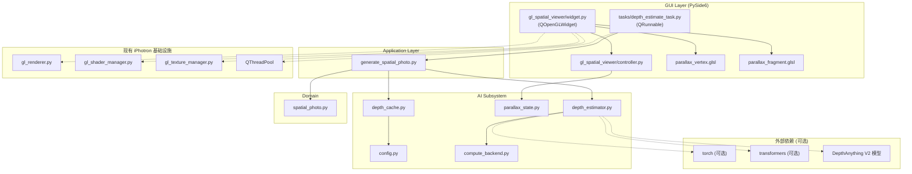
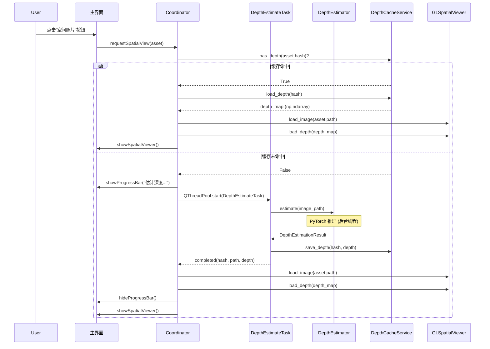
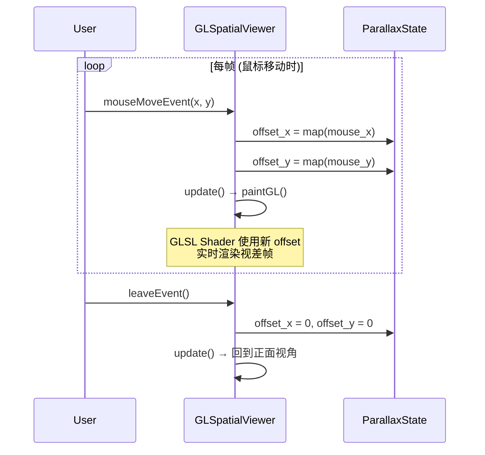

# 🛠️ DepthFlow 2.5D 空间照片 — 开发文档

> **版本:** 1.0 · 2026-02-18
>
> 本文档面向开发者，详细描述基于 DepthFlow 算法（深度图 + GLSL 射线行进）在 iPhotron 中实现 2.5D 空间照片功能的**完整开发方案、文件结构、核心类设计、GLSL 着色器、信号流、数据流**，以及逐步开发指南。
>
> 前置阅读：[可行性报告](./feasibility_report.md)（第 9-10 节 DepthFlow 对比评估）

---

## 目录

1. [设计原则与集成策略](#1-设计原则与集成策略)
2. [文件结构](#2-文件结构)
3. [模块依赖关系](#3-模块依赖关系)
4. [核心类设计](#4-核心类设计)
   - 4.1 [深度图估计器](#41-深度图估计器)
   - 4.2 [视差状态模型](#42-视差状态模型)
   - 4.3 [空间照片查看器 Widget (QOpenGLWidget)](#43-空间照片查看器-widget-qopenglwidget)
   - 4.4 [交互控制器](#44-交互控制器)
   - 4.5 [深度图缓存服务](#45-深度图缓存服务)
   - 4.6 [后台深度估计任务](#46-后台深度估计任务)
   - 4.7 [生成空间照片用例](#47-生成空间照片用例)
5. [GLSL 着色器详细设计](#5-glsl-着色器详细设计)
   - 5.1 [顶点着色器](#51-顶点着色器)
   - 5.2 [Fragment 着色器 — 核心视差算法](#52-fragment-着色器--核心视差算法)
   - 5.3 [Uniform 参数一览](#53-uniform-参数一览)
   - 5.4 [与 iPhotron 现有 Shader 管线的适配](#54-与-iphoto-现有-shader-管线的适配)
6. [信号流与事件体系](#6-信号流与事件体系)
   - 6.1 [空间照片进入流程](#61-空间照片进入流程)
   - 6.2 [实时交互信号流](#62-实时交互信号流)
7. [数据流](#7-数据流)
   - 7.1 [深度图生成流程](#71-深度图生成流程)
   - 7.2 [实时渲染数据流](#72-实时渲染数据流)
   - 7.3 [缓存命中流程](#73-缓存命中流程)
8. [深度估计模型选型](#8-深度估计模型选型)
9. [配置项](#9-配置项)
10. [依赖安装与 pyproject.toml 变更](#10-依赖安装与-pyprojecttoml-变更)
11. [数据库与缓存设计](#11-数据库与缓存设计)
12. [测试策略](#12-测试策略)
13. [开发里程碑与任务分解](#13-开发里程碑与任务分解)

---

## 1. 设计原则与集成策略

### 1.1 核心设计原则

1. **不直接依赖 DepthFlow 包**：DepthFlow 的 AGPL-3.0 许可证会传染整个项目。采用**参考算法自研 GLSL Shader** 的方式，仅学习其射线行进思路，在 iPhotron 现有 PyOpenGL 管线中从零实现。
2. **复用现有 OpenGL 基础设施**：复用 `gl_renderer.py`、`gl_shader_manager.py`、`gl_texture_manager.py`、`QOpenGLWidget` 等已有模块，新增代码量最小化。
3. **非侵入**：空间照片功能作为独立子模块，不修改现有代码的执行路径。
4. **可选依赖**：深度估计所需的 PyTorch 作为 optional dependency，基础渲染功能（用户手动提供深度图）不依赖任何 AI 框架。
5. **后台处理**：深度估计在后台 `QRunnable` 中异步执行，不阻塞 GUI 主线程。

### 1.2 集成策略

```
            ┌─ 基础模式 (零 AI 依赖) ─────────────────────┐
            │  用户手动提供深度图                            │
            │  → 加载照片 + 深度图为 OpenGL 纹理             │
            │  → GLSL Shader 实时视差渲染                   │
            │  → 鼠标交互驱动视角                           │
            └──────────────────────────────────────────────┘

            ┌─ 完整模式 (pip install iPhoto[3d]) ──────────┐
            │  自动估计深度图 (DepthAnything V2)             │
            │  → 后台 PyTorch 推理                          │
            │  → 深度图缓存到 .iphoto_spatial/               │
            │  → GLSL Shader 实时视差渲染                   │
            └──────────────────────────────────────────────┘
```

---

## 2. 文件结构

遵循 iPhotron 已有的 MVVM + DDD 分层架构。

```
src/iPhoto/
├── ai/                                          # AI 子系统根目录
│   ├── __init__.py
│   ├── compute_backend.py                       # 通用 GPU/CPU 后端检测 (与人脸/OCR 共用)
│   │
│   └── spatial/                                 # 🆕 空间照片子模块
│       ├── __init__.py
│       ├── config.py                            # 视差效果配置常量
│       ├── depth_estimator.py                   # 深度图估计器 (DepthAnything V2 封装)
│       ├── depth_cache.py                       # 深度图文件缓存管理
│       └── parallax_state.py                    # 视差参数状态模型
│
├── domain/
│   └── models/
│       └── spatial_photo.py                     # 🆕 空间照片领域模型
│
├── application/
│   └── use_cases/
│       └── generate_spatial_photo.py            # 🆕 生成空间照片用例 (编排深度估计+缓存)
│
├── gui/
│   └── ui/
│       ├── widgets/
│       │   └── gl_spatial_viewer/               # 🆕 空间照片查看器
│       │       ├── __init__.py
│       │       ├── widget.py                    # QOpenGLWidget 子类 — 视差渲染
│       │       ├── controller.py                # 鼠标/触控板交互控制器
│       │       ├── parallax_vertex.glsl         # 顶点着色器 (全屏三角形)
│       │       └── parallax_fragment.glsl       # 🔑 核心视差 Fragment Shader
│       │
│       └── tasks/
│           └── depth_estimate_task.py           # 🆕 后台深度估计 QRunnable
│
└── schemas/
    └── spatial_config.schema.json               # 🆕 空间照片配置 JSON Schema
```

**文件数量**：新增 ~12 个文件，修改 ~2 个文件（`pyproject.toml` + 主界面入口）

---

## 3. 模块依赖关系



**关键特点**：虚线表示可选依赖或松耦合引用。GLSL 渲染管线不依赖任何 AI 框架。

---

## 4. 核心类设计

### 4.1 深度图估计器

```python
# src/iPhoto/ai/spatial/depth_estimator.py
from __future__ import annotations

import logging
from dataclasses import dataclass
from enum import Enum
from pathlib import Path

import numpy as np
from PIL import Image

LOGGER = logging.getLogger(__name__)


class DepthModel(Enum):
    """支持的深度估计模型。"""
    DEPTH_ANYTHING_V2_SMALL = "depth-anything-v2-small"   # ~100MB, 快速
    DEPTH_ANYTHING_V2_BASE = "depth-anything-v2-base"     # ~200MB, 平衡
    DEPTH_ANYTHING_V2_LARGE = "depth-anything-v2-large"   # ~400MB, 最佳质量


@dataclass
class DepthEstimationResult:
    """深度估计结果。"""
    depth_map: np.ndarray       # (H, W) float32, 归一化到 [0, 1]
    image_size: tuple[int, int] # (宽, 高)
    model_used: str             # 使用的模型名
    device_used: str            # 使用的设备
    inference_time_s: float     # 推理耗时 (秒)


class DepthEstimator:
    """深度图估计器。

    封装 HuggingFace DepthAnything V2 模型，提供简洁 API：
        estimator = DepthEstimator(model=DepthModel.DEPTH_ANYTHING_V2_SMALL)
        result = estimator.estimate(image_path)
        result.depth_map  # (H, W) float32, [0, 1]
    """

    def __init__(
        self,
        model: DepthModel = DepthModel.DEPTH_ANYTHING_V2_SMALL,
        device: str = "auto",
    ):
        self._model_name = model
        self._device_str = device
        self._pipeline = None  # 延迟加载

    def _ensure_loaded(self):
        """延迟加载模型 (首次调用时)。"""
        if self._pipeline is not None:
            return

        import torch
        from transformers import pipeline

        # 设备选择
        if self._device_str == "auto":
            if torch.cuda.is_available():
                device = "cuda"
            elif torch.mps.is_available():
                device = "mps"
            else:
                device = "cpu"
        else:
            device = self._device_str

        LOGGER.info("加载深度估计模型: %s (设备: %s)", self._model_name.value, device)

        self._pipeline = pipeline(
            task="depth-estimation",
            model=f"depth-anything/{self._model_name.value}",
            device=device,
        )
        self._device_used = device

    def estimate(self, image_path: Path) -> DepthEstimationResult:
        """估计单张照片的深度图。

        Args:
            image_path: 输入照片路径 (支持 JPG/PNG/HEIC)

        Returns:
            DepthEstimationResult
        """
        import time

        self._ensure_loaded()

        image = Image.open(image_path).convert("RGB")
        width, height = image.size

        start = time.perf_counter()
        output = self._pipeline(image)
        elapsed = time.perf_counter() - start

        # transformers depth-estimation 返回 PIL Image
        depth_pil = output["depth"]
        depth_np = np.array(depth_pil, dtype=np.float32)

        # 归一化到 [0, 1]
        d_min, d_max = depth_np.min(), depth_np.max()
        if d_max - d_min > 1e-6:
            depth_np = (depth_np - d_min) / (d_max - d_min)
        else:
            depth_np = np.zeros_like(depth_np)

        LOGGER.info(
            "深度估计完成: %s, %.2f秒, 尺寸=%dx%d",
            self._model_name.value, elapsed, width, height,
        )

        return DepthEstimationResult(
            depth_map=depth_np,
            image_size=(width, height),
            model_used=self._model_name.value,
            device_used=self._device_used,
            inference_time_s=elapsed,
        )

    def estimate_from_array(self, image: np.ndarray) -> np.ndarray:
        """从 numpy 数组估计深度图。

        Args:
            image: (H, W, 3) uint8 RGB

        Returns:
            (H, W) float32 深度图, [0, 1]
        """
        self._ensure_loaded()
        pil_image = Image.fromarray(image)
        output = self._pipeline(pil_image)
        depth_np = np.array(output["depth"], dtype=np.float32)
        d_min, d_max = depth_np.min(), depth_np.max()
        if d_max - d_min > 1e-6:
            depth_np = (depth_np - d_min) / (d_max - d_min)
        return depth_np

    def unload(self):
        """释放模型占用的 GPU/CPU 内存。"""
        if self._pipeline is not None:
            del self._pipeline
            self._pipeline = None
            try:
                import torch
                if torch.cuda.is_available():
                    torch.cuda.empty_cache()
            except ImportError:
                pass
```

### 4.2 视差状态模型

```python
# src/iPhoto/ai/spatial/parallax_state.py
from __future__ import annotations

from dataclasses import dataclass, field


@dataclass
class ParallaxState:
    """视差效果的完整参数状态。

    参考 DepthFlow 的参数体系，适配 iPhotron 的交互式空间照片场景。
    所有参数通过 Uniform 传递给 GLSL Shader。
    """

    # ── 核心视差参数 ──
    height: float = 0.20
    """深度图峰值高度，即视差强度。值越大 3D 效果越强。范围 [0, 1]"""

    steady: float = 0.0
    """焦平面位置。0 = 背景静止, 1 = 前景静止。范围 [0, 1]"""

    focus: float = 0.0
    """透视焦平面。影响透视投影的焦点深度。范围 [0, 1]"""

    zoom: float = 1.0
    """相机缩放系数。1.0 = 原始大小。范围 [0.5, 2.0]"""

    isometric: float = 0.0
    """等距投影系数。0 = 透视投影, 1 = 正交投影。范围 [0, 1]"""

    dolly: float = 0.0
    """Dolly 推移距离。模拟相机前后移动。范围 [0, 5]"""

    invert: float = 0.0
    """深度反转。0 = 正常, 1 = 深度翻转。范围 [0, 1]"""

    mirror: bool = True
    """越界区域镜像重复 (GL_MIRRORED_REPEAT)"""

    # ── 偏移量 (由鼠标/动画驱动) ──
    offset_x: float = 0.0
    """水平视差位移。鼠标左右移动驱动此值。范围 [-2, 2]"""

    offset_y: float = 0.0
    """垂直视差位移。鼠标上下移动驱动此值。范围 [-2, 2]"""

    # ── 中心点 ──
    center_x: float = 0.0
    """相机真实水平位置"""

    center_y: float = 0.0
    """相机真实垂直位置"""

    # ── 原点 (高度变化的固定点) ──
    origin_x: float = 0.0
    """偏移量的水平焦点"""

    origin_y: float = 0.0
    """偏移量的垂直焦点"""

    # ── 渲染质量 ──
    quality: float = 0.5
    """射线行进质量。0 = 低 (快), 1 = 高 (慢)。范围 [0, 1]"""

    # ── 后处理 ──
    vignette_enable: bool = False
    """启用暗角效果"""

    vignette_intensity: float = 0.2
    """暗角强度。范围 [0, 1]"""

    vignette_decay: float = 20.0
    """暗角衰减速度。范围 [0, 100]"""

    def get_uniforms(self) -> dict[str, float | int | bool | tuple]:
        """导出所有参数为 Uniform 字典。

        键名对应 GLSL Shader 中的 uniform 变量名。
        """
        return {
            "iDepthHeight": self.height,
            "iDepthSteady": self.steady,
            "iDepthFocus": self.focus,
            "iDepthZoom": self.zoom,
            "iDepthIsometric": self.isometric,
            "iDepthDolly": self.dolly,
            "iDepthInvert": self.invert,
            "iDepthMirror": self.mirror,
            "iDepthOffset": (self.offset_x, self.offset_y),
            "iDepthCenter": (self.center_x, self.center_y),
            "iDepthOrigin": (self.origin_x, self.origin_y),
            "iQuality": self.quality,
            "iVigEnable": self.vignette_enable,
            "iVigIntensity": self.vignette_intensity,
            "iVigDecay": self.vignette_decay,
        }
```

### 4.3 空间照片查看器 Widget (QOpenGLWidget)

```python
# src/iPhoto/gui/ui/widgets/gl_spatial_viewer/widget.py
from __future__ import annotations

import logging
from pathlib import Path

import numpy as np
from OpenGL import GL
from PySide6.QtCore import Qt, Signal
from PySide6.QtGui import QImage, QMouseEvent, QSurfaceFormat
from PySide6.QtOpenGL import (
    QOpenGLShader,
    QOpenGLShaderProgram,
    QOpenGLVertexArrayObject,
)
from PySide6.QtOpenGLWidgets import QOpenGLWidget

from iPhoto.ai.spatial.parallax_state import ParallaxState

LOGGER = logging.getLogger(__name__)

# 着色器路径
_SHADER_DIR = Path(__file__).parent
_VERT_PATH = _SHADER_DIR / "parallax_vertex.glsl"
_FRAG_PATH = _SHADER_DIR / "parallax_fragment.glsl"


class GLSpatialViewer(QOpenGLWidget):
    """空间照片查看器 — 基于 GLSL 深度视差的交互式渲染 Widget。

    核心原理：
    1. 加载原始照片和深度图为 OpenGL 纹理
    2. Fragment Shader 使用射线行进算法，根据深度图对像素进行视差位移
    3. 鼠标移动驱动 offset_x / offset_y 参数，产生 3D 视差效果

    使用方式：
        viewer = GLSpatialViewer(parent)
        viewer.load_image(image_path)
        viewer.load_depth(depth_map)  # np.ndarray (H, W) float32
    """

    # 信号
    viewAngleChanged = Signal(float, float)  # (offset_x, offset_y)
    depthMapRequired = Signal(str)           # asset_path — 请求生成深度图

    # 视差范围限制 (鼠标映射到的 offset 范围)
    MAX_OFFSET = 0.8

    def __init__(self, parent=None):
        super().__init__(parent)
        self._state = ParallaxState()
        self._program: QOpenGLShaderProgram | None = None
        self._vao: QOpenGLVertexArrayObject | None = None
        self._image_texture: int = 0   # GL 纹理 ID
        self._depth_texture: int = 0   # GL 纹理 ID
        self._image_loaded = False
        self._depth_loaded = False
        self._image_aspect = 1.0
        self.setMouseTracking(True)

    # ── 公开 API ──

    def load_image_from_path(self, image_path: Path):
        """从文件路径加载照片纹理。"""
        from PIL import Image as PILImage

        img = PILImage.open(image_path).convert("RGB")
        self._image_aspect = img.width / img.height
        img_data = np.array(img, dtype=np.uint8)
        self._upload_texture_rgb(img_data, is_depth=False)
        self._image_loaded = True
        self.update()

    def load_image_from_array(self, image: np.ndarray):
        """从 numpy 数组加载照片纹理。(H, W, 3) uint8 RGB"""
        h, w = image.shape[:2]
        self._image_aspect = w / h
        self._upload_texture_rgb(image, is_depth=False)
        self._image_loaded = True
        self.update()

    def load_depth_from_array(self, depth: np.ndarray):
        """加载深度图纹理。(H, W) float32, [0, 1]"""
        self._upload_texture_depth(depth)
        self._depth_loaded = True
        self.update()

    def load_depth_from_path(self, depth_path: Path):
        """从灰度图文件加载深度图。"""
        from PIL import Image as PILImage

        depth_img = PILImage.open(depth_path).convert("L")
        depth_np = np.array(depth_img, dtype=np.float32) / 255.0
        self.load_depth_from_array(depth_np)

    def set_state(self, state: ParallaxState):
        """设置视差参数状态。"""
        self._state = state
        self.update()

    @property
    def state(self) -> ParallaxState:
        return self._state

    @property
    def is_ready(self) -> bool:
        """图片和深度图是否都已加载。"""
        return self._image_loaded and self._depth_loaded

    # ── OpenGL 生命周期 ──

    def initializeGL(self):
        """初始化 OpenGL 资源。"""
        GL.glClearColor(0.0, 0.0, 0.0, 1.0)

        # 编译着色器
        self._program = QOpenGLShaderProgram(self)
        self._program.addShaderFromSourceFile(QOpenGLShader.ShaderTypeBit.Vertex, str(_VERT_PATH))
        self._program.addShaderFromSourceFile(QOpenGLShader.ShaderTypeBit.Fragment, str(_FRAG_PATH))
        self._program.link()

        # 全屏三角形 VAO (无需 VBO，顶点在 Shader 中生成)
        self._vao = QOpenGLVertexArrayObject(self)
        self._vao.create()

        # 创建纹理
        self._image_texture = GL.glGenTextures(1)
        self._depth_texture = GL.glGenTextures(1)

    def paintGL(self):
        """渲染帧。"""
        GL.glClear(GL.GL_COLOR_BUFFER_BIT)

        if not self.is_ready or self._program is None:
            return

        self._program.bind()
        self._vao.bind()

        # 绑定纹理
        GL.glActiveTexture(GL.GL_TEXTURE0)
        GL.glBindTexture(GL.GL_TEXTURE_2D, self._image_texture)
        self._program.setUniformValue("image", 0)

        GL.glActiveTexture(GL.GL_TEXTURE1)
        GL.glBindTexture(GL.GL_TEXTURE_2D, self._depth_texture)
        self._program.setUniformValue("depthmap", 1)

        # 传递 Uniform 参数
        uniforms = self._state.get_uniforms()
        for name, value in uniforms.items():
            if isinstance(value, bool):
                self._program.setUniformValue(name, int(value))
            elif isinstance(value, float):
                self._program.setUniformValue(name, value)
            elif isinstance(value, tuple) and len(value) == 2:
                self._program.setUniformValue(name, *value)

        # 传递分辨率
        self._program.setUniformValue("iResolution", float(self.width()), float(self.height()))
        self._program.setUniformValue("iAspectRatio", self._image_aspect)

        # 绘制全屏三角形
        GL.glDrawArrays(GL.GL_TRIANGLES, 0, 3)

        self._vao.release()
        self._program.release()

    def resizeGL(self, w, h):
        """窗口大小变更。"""
        GL.glViewport(0, 0, w, h)

    # ── 鼠标交互 ──

    def mouseMoveEvent(self, event: QMouseEvent):
        """鼠标移动驱动视差偏移。"""
        if not self.is_ready:
            return

        cx, cy = self.width() / 2.0, self.height() / 2.0
        pos = event.position()

        # 映射鼠标位置到 [-MAX_OFFSET, +MAX_OFFSET]
        ox = (pos.x() - cx) / cx * self.MAX_OFFSET
        oy = -(pos.y() - cy) / cy * self.MAX_OFFSET  # Y 轴翻转

        self._state.offset_x = max(-self.MAX_OFFSET, min(self.MAX_OFFSET, ox))
        self._state.offset_y = max(-self.MAX_OFFSET, min(self.MAX_OFFSET, oy))

        self.viewAngleChanged.emit(self._state.offset_x, self._state.offset_y)
        self.update()

    def leaveEvent(self, event):
        """鼠标离开时回到中心位置。"""
        self._state.offset_x = 0.0
        self._state.offset_y = 0.0
        self.update()

    # ── 纹理上传 ──

    def _upload_texture_rgb(self, data: np.ndarray, is_depth: bool):
        """上传 RGB 纹理到 GPU。"""
        self.makeCurrent()
        h, w = data.shape[:2]
        tex_id = self._depth_texture if is_depth else self._image_texture

        GL.glBindTexture(GL.GL_TEXTURE_2D, tex_id)
        GL.glTexParameteri(GL.GL_TEXTURE_2D, GL.GL_TEXTURE_MIN_FILTER, GL.GL_LINEAR)
        GL.glTexParameteri(GL.GL_TEXTURE_2D, GL.GL_TEXTURE_MAG_FILTER, GL.GL_LINEAR)
        GL.glTexParameteri(GL.GL_TEXTURE_2D, GL.GL_TEXTURE_WRAP_S, GL.GL_MIRRORED_REPEAT)
        GL.glTexParameteri(GL.GL_TEXTURE_2D, GL.GL_TEXTURE_WRAP_T, GL.GL_MIRRORED_REPEAT)
        GL.glTexImage2D(
            GL.GL_TEXTURE_2D, 0, GL.GL_RGB8, w, h, 0,
            GL.GL_RGB, GL.GL_UNSIGNED_BYTE, data.tobytes(),
        )
        self.doneCurrent()

    def _upload_texture_depth(self, data: np.ndarray):
        """上传深度图纹理到 GPU。(H, W) float32"""
        self.makeCurrent()
        h, w = data.shape[:2]

        GL.glBindTexture(GL.GL_TEXTURE_2D, self._depth_texture)
        GL.glTexParameteri(GL.GL_TEXTURE_2D, GL.GL_TEXTURE_MIN_FILTER, GL.GL_LINEAR)
        GL.glTexParameteri(GL.GL_TEXTURE_2D, GL.GL_TEXTURE_MAG_FILTER, GL.GL_LINEAR)
        GL.glTexParameteri(GL.GL_TEXTURE_2D, GL.GL_TEXTURE_WRAP_S, GL.GL_MIRRORED_REPEAT)
        GL.glTexParameteri(GL.GL_TEXTURE_2D, GL.GL_TEXTURE_WRAP_T, GL.GL_MIRRORED_REPEAT)
        GL.glTexImage2D(
            GL.GL_TEXTURE_2D, 0, GL.GL_R32F, w, h, 0,
            GL.GL_RED, GL.GL_FLOAT, data.tobytes(),
        )
        self.doneCurrent()
```

### 4.4 交互控制器

```python
# src/iPhoto/gui/ui/widgets/gl_spatial_viewer/controller.py
from __future__ import annotations

from dataclasses import dataclass

from PySide6.QtCore import QObject, Signal


@dataclass
class InteractionConfig:
    """交互参数配置。"""
    sensitivity: float = 1.0       # 鼠标灵敏度
    max_offset: float = 0.8        # 最大偏移量
    smoothing: float = 0.15        # 平滑系数 (0=无平滑, 1=最大平滑)
    return_to_center: bool = True  # 鼠标离开时是否回到中心


class SpatialInteractionController(QObject):
    """空间照片交互控制器。

    管理鼠标/触控板输入到视差参数的映射，
    提供平滑插值和灵敏度调节。
    """

    offsetChanged = Signal(float, float)  # (offset_x, offset_y)

    def __init__(self, config: InteractionConfig | None = None, parent=None):
        super().__init__(parent)
        self._config = config or InteractionConfig()
        self._target_x = 0.0
        self._target_y = 0.0
        self._current_x = 0.0
        self._current_y = 0.0

    def update_from_mouse(
        self,
        mouse_x: float, mouse_y: float,
        widget_w: float, widget_h: float,
    ):
        """根据鼠标位置更新视差目标。

        Args:
            mouse_x/y: 鼠标在 Widget 中的位置 (像素)
            widget_w/h: Widget 尺寸 (像素)
        """
        cx, cy = widget_w / 2.0, widget_h / 2.0
        max_off = self._config.max_offset * self._config.sensitivity

        self._target_x = (mouse_x - cx) / cx * max_off
        self._target_y = -(mouse_y - cy) / cy * max_off

        # 限幅
        self._target_x = max(-max_off, min(max_off, self._target_x))
        self._target_y = max(-max_off, min(max_off, self._target_y))

        # 平滑插值
        s = 1.0 - self._config.smoothing
        self._current_x += (self._target_x - self._current_x) * s
        self._current_y += (self._target_y - self._current_y) * s

        self.offsetChanged.emit(self._current_x, self._current_y)

    def reset(self):
        """重置到中心位置。"""
        self._target_x = 0.0
        self._target_y = 0.0
        if self._config.return_to_center:
            self._current_x = 0.0
            self._current_y = 0.0
            self.offsetChanged.emit(0.0, 0.0)
```

### 4.5 深度图缓存服务

```python
# src/iPhoto/ai/spatial/depth_cache.py
from __future__ import annotations

import logging
from pathlib import Path

import numpy as np
from PIL import Image

LOGGER = logging.getLogger(__name__)


class DepthCacheService:
    """深度图文件缓存管理。

    缓存目录结构：
        {album_path}/.iphoto_spatial/
        ├── {asset_hash}_depth.png     # 深度图 (8-bit 灰度 PNG)
        └── ...

    深度图存为 8-bit PNG 以节省空间。16-bit PNG 可选用于更高精度。
    """

    CACHE_DIR_NAME = ".iphoto_spatial"

    def __init__(self, album_path: Path):
        self._album_path = album_path
        self._cache_dir = album_path / self.CACHE_DIR_NAME

    def has_depth(self, asset_hash: str) -> bool:
        """检查是否已有缓存的深度图。"""
        return self._depth_path(asset_hash).exists()

    def save_depth(self, asset_hash: str, depth: np.ndarray) -> Path:
        """保存深度图到缓存。

        Args:
            asset_hash: 原始照片的 xxhash
            depth: (H, W) float32, [0, 1]

        Returns:
            保存的文件路径
        """
        self._cache_dir.mkdir(parents=True, exist_ok=True)
        path = self._depth_path(asset_hash)

        # 转换为 8-bit 灰度 PNG
        depth_uint8 = (depth * 255).clip(0, 255).astype(np.uint8)
        Image.fromarray(depth_uint8, mode="L").save(path)

        LOGGER.debug("深度图已缓存: %s (%d bytes)", path, path.stat().st_size)
        return path

    def load_depth(self, asset_hash: str) -> np.ndarray:
        """从缓存加载深度图。

        Returns:
            (H, W) float32, [0, 1]
        """
        path = self._depth_path(asset_hash)
        depth_img = Image.open(path).convert("L")
        return np.array(depth_img, dtype=np.float32) / 255.0

    def clear_cache(self, asset_hash: str | None = None):
        """清除缓存。"""
        import shutil

        if asset_hash:
            path = self._depth_path(asset_hash)
            if path.exists():
                path.unlink()
        else:
            if self._cache_dir.exists():
                shutil.rmtree(self._cache_dir)

    def cache_size_bytes(self) -> int:
        """获取缓存总大小 (字节)。"""
        if not self._cache_dir.exists():
            return 0
        return sum(
            f.stat().st_size for f in self._cache_dir.rglob("*") if f.is_file()
        )

    def _depth_path(self, asset_hash: str) -> Path:
        return self._cache_dir / f"{asset_hash}_depth.png"
```

### 4.6 后台深度估计任务

```python
# src/iPhoto/gui/ui/tasks/depth_estimate_task.py
from __future__ import annotations

import logging
from pathlib import Path

from PySide6.QtCore import QObject, QRunnable, Signal, Slot

LOGGER = logging.getLogger(__name__)


class DepthEstimateSignals(QObject):
    """深度估计任务信号。"""
    started = Signal(str)                        # asset_hash
    progress = Signal(str, int)                  # asset_hash, 百分比
    completed = Signal(str, str, object)         # asset_hash, depth_cache_path, depth_array
    error = Signal(str, str)                     # asset_hash, error_message


class DepthEstimateTask(QRunnable):
    """后台深度图估计任务。

    遵循 iPhotron 已有的 QRunnable 任务模式：
    1. 在后台线程中运行深度估计
    2. 通过信号报告进度和结果
    3. 结果缓存到 .iphoto_spatial/ 目录
    """

    def __init__(
        self,
        image_path: Path,
        asset_hash: str,
        album_path: Path,
        model: str = "depth-anything-v2-small",
        device: str = "auto",
    ):
        super().__init__()
        self.signals = DepthEstimateSignals()
        self._image_path = image_path
        self._asset_hash = asset_hash
        self._album_path = album_path
        self._model = model
        self._device = device
        self.setAutoDelete(True)

    @Slot()
    def run(self):
        """执行深度估计。"""
        try:
            self.signals.started.emit(self._asset_hash)
            self.signals.progress.emit(self._asset_hash, 10)

            # Step 1: 检查缓存
            from iPhoto.ai.spatial.depth_cache import DepthCacheService

            cache = DepthCacheService(self._album_path)
            if cache.has_depth(self._asset_hash):
                depth = cache.load_depth(self._asset_hash)
                path = cache._depth_path(self._asset_hash)
                self.signals.progress.emit(self._asset_hash, 100)
                self.signals.completed.emit(self._asset_hash, str(path), depth)
                return

            # Step 2: 深度估计
            self.signals.progress.emit(self._asset_hash, 20)

            from iPhoto.ai.spatial.depth_estimator import DepthEstimator, DepthModel

            model_enum = DepthModel(self._model)
            estimator = DepthEstimator(model=model_enum, device=self._device)
            self.signals.progress.emit(self._asset_hash, 50)

            result = estimator.estimate(self._image_path)
            self.signals.progress.emit(self._asset_hash, 80)

            # Step 3: 缓存结果
            path = cache.save_depth(self._asset_hash, result.depth_map)

            # 释放模型
            estimator.unload()

            self.signals.progress.emit(self._asset_hash, 100)
            self.signals.completed.emit(
                self._asset_hash, str(path), result.depth_map
            )

        except ImportError as e:
            self.signals.error.emit(
                self._asset_hash,
                f"缺少 3D 功能依赖，请运行: pip install iPhoto[3d]\n{e}",
            )
        except Exception as e:
            LOGGER.exception("深度估计失败: %s", self._image_path)
            self.signals.error.emit(self._asset_hash, str(e))
```

### 4.7 生成空间照片用例

```python
# src/iPhoto/application/use_cases/generate_spatial_photo.py
from __future__ import annotations

import logging
from dataclasses import dataclass
from pathlib import Path

import numpy as np

LOGGER = logging.getLogger(__name__)


@dataclass
class SpatialPhotoResult:
    """空间照片生成结果。"""
    image_path: Path
    depth_path: Path
    depth_map: np.ndarray       # (H, W) float32, [0, 1]
    from_cache: bool
    model_used: str | None      # None 表示用户手动提供


class GenerateSpatialPhotoUseCase:
    """生成空间照片用例。

    编排深度估计 + 缓存的完整流程。
    支持两种模式：
    1. 自动模式：AI 估计深度图
    2. 手动模式：用户提供深度图文件
    """

    def __init__(self, album_path: Path):
        from iPhoto.ai.spatial.depth_cache import DepthCacheService
        self._cache = DepthCacheService(album_path)

    def execute_auto(
        self,
        image_path: Path,
        asset_hash: str,
        model: str = "depth-anything-v2-small",
        device: str = "auto",
    ) -> SpatialPhotoResult:
        """自动模式：AI 估计深度图。"""
        # 检查缓存
        if self._cache.has_depth(asset_hash):
            depth = self._cache.load_depth(asset_hash)
            depth_path = self._cache._depth_path(asset_hash)
            LOGGER.info("深度图缓存命中: %s", asset_hash)
            return SpatialPhotoResult(
                image_path=image_path,
                depth_path=depth_path,
                depth_map=depth,
                from_cache=True,
                model_used=model,
            )

        # AI 估计
        from iPhoto.ai.spatial.depth_estimator import DepthEstimator, DepthModel

        estimator = DepthEstimator(model=DepthModel(model), device=device)
        result = estimator.estimate(image_path)
        depth_path = self._cache.save_depth(asset_hash, result.depth_map)
        estimator.unload()

        return SpatialPhotoResult(
            image_path=image_path,
            depth_path=depth_path,
            depth_map=result.depth_map,
            from_cache=False,
            model_used=model,
        )

    def execute_manual(
        self,
        image_path: Path,
        depth_path: Path,
        asset_hash: str,
    ) -> SpatialPhotoResult:
        """手动模式：用户提供深度图。"""
        from PIL import Image

        depth_img = Image.open(depth_path).convert("L")
        depth = np.array(depth_img, dtype=np.float32) / 255.0

        # 缓存用户提供的深度图
        self._cache.save_depth(asset_hash, depth)

        return SpatialPhotoResult(
            image_path=image_path,
            depth_path=depth_path,
            depth_map=depth,
            from_cache=False,
            model_used=None,
        )
```

---

## 5. GLSL 着色器详细设计

### 5.1 顶点着色器

```glsl
// src/iPhoto/gui/ui/widgets/gl_spatial_viewer/parallax_vertex.glsl
#version 330 core

// 全屏三角形 — 无需 VBO，在 Shader 中生成顶点
// 使用 gl_VertexID 生成覆盖整个屏幕的超大三角形

out vec2 v_uv;  // 纹理坐标 [0, 1]

void main() {
    // 生成覆盖全屏的三角形顶点
    // gl_VertexID: 0, 1, 2
    float x = float((gl_VertexID & 1) << 2) - 1.0;  // -1, 3, -1
    float y = float((gl_VertexID & 2) << 1) - 1.0;  // -1, -1, 3

    gl_Position = vec4(x, y, 0.0, 1.0);
    v_uv = vec2(x + 1.0, y + 1.0) * 0.5;  // [0, 1]
}
```

### 5.2 Fragment 着色器 — 核心视差算法

这是整个功能的核心，参考 DepthFlow 的射线行进算法自研实现。

```glsl
// src/iPhoto/gui/ui/widgets/gl_spatial_viewer/parallax_fragment.glsl
#version 330 core

// ── 输入 ──
in vec2 v_uv;
out vec4 fragColor;

// ── 纹理 ──
uniform sampler2D image;       // 原始照片
uniform sampler2D depthmap;    // 深度图 (R 通道, [0, 1])

// ── 视差参数 (由 Python 端传入) ──
uniform float iDepthHeight;    // 视差强度 [0, 1]
uniform float iDepthSteady;    // 焦平面位置 [0, 1]
uniform float iDepthFocus;     // 透视焦点 [0, 1]
uniform float iDepthZoom;      // 缩放 [0.5, 2]
uniform float iDepthIsometric; // 等距系数 [0, 1]
uniform float iDepthDolly;     // Dolly 推移 [0, 5]
uniform float iDepthInvert;    // 深度反转 [0, 1]
uniform bool  iDepthMirror;    // 越界镜像
uniform vec2  iDepthOffset;    // 视差位移 (由鼠标驱动)
uniform vec2  iDepthCenter;    // 相机中心
uniform vec2  iDepthOrigin;    // 焦点原点

// ── 渲染质量 ──
uniform float iQuality;        // 射线行进质量 [0, 1]

// ── 视口信息 ──
uniform vec2  iResolution;     // 窗口分辨率 (像素)
uniform float iAspectRatio;    // 图片宽高比

// ── 后处理 ──
uniform bool  iVigEnable;
uniform float iVigIntensity;
uniform float iVigDecay;

// ── 辅助函数 ──

vec4 sampleImage(vec2 uv) {
    // 采样图像，支持镜像重复或黑色填充
    if (iDepthMirror) {
        // GL_MIRRORED_REPEAT 由纹理参数处理
        return texture(image, uv);
    } else {
        if (uv.x < 0.0 || uv.x > 1.0 || uv.y < 0.0 || uv.y > 1.0)
            return vec4(0.0, 0.0, 0.0, 1.0);
        return texture(image, uv);
    }
}

float sampleDepth(vec2 uv) {
    return texture(depthmap, uv).r;
}

// ── 主函数 ──

void main() {
    // 将 UV 转换为以中心为原点的坐标 [-aspect, aspect] x [-1, 1]
    vec2 centered = (v_uv - 0.5) * 2.0;
    centered.x *= iAspectRatio;

    // ── 相机投影 ──
    float rel_focus  = iDepthFocus  * iDepthHeight;
    float rel_steady = iDepthSteady * iDepthHeight;

    // 相机位置 = 中心 + 偏移
    vec2 cam_pos = iDepthCenter + iDepthOffset;

    // 缩放
    float zoom = iDepthZoom;

    // 透视/等距混合
    float focal = 1.0 - rel_focus;

    // 射线起点 (相机位置 + dolly 后退)
    vec3 ray_origin = vec3(cam_pos, -(iDepthDolly));

    // 射线与图像平面的交点
    vec2 gluv = centered / zoom;  // 应用缩放
    gluv = gluv * mix(1.0, focal, 1.0 - iDepthIsometric);  // 透视/等距

    // 射线目标 (图像平面上的点)
    vec3 intersect = vec3(gluv + iDepthCenter, 1.0)
        - vec3(cam_pos, 0.0) * (1.0 / max(1.0 - rel_steady, 0.001));

    // ── 射线行进 (Ray Marching) ──
    // 两阶段算法: 前向粗探测 + 反向精炼

    float step_probe = 1.0 / mix(50.0, 120.0, iQuality);   // 粗步长
    float step_fine  = 1.0 / mix(200.0, 2000.0, iQuality);  // 细步长
    float safe_dist  = 1.0 - iDepthHeight;  // 保证不碰到表面的最小距离

    float walk = 0.0;
    float depth_value = 0.0;
    vec2 final_uv = v_uv;

    // Stage 1: 前向探测 — 快速找到射线进入表面的位置
    for (int i = 0; i < 200; i++) {
        if (walk > 1.0) break;
        walk += step_probe;

        vec3 point = mix(ray_origin, intersect, mix(safe_dist, 1.0, walk));
        vec2 sample_uv = point.xy * 0.5 + 0.5;  // 转回 [0, 1]
        final_uv = sample_uv;

        depth_value = sampleDepth(sample_uv);
        float surface = iDepthHeight * mix(depth_value, 1.0 - depth_value, iDepthInvert);
        float ceiling = 1.0 - point.z;

        if (ceiling < surface) break;  // 进入表面
    }

    // Stage 2: 反向精炼 — 以更小步长精确找到表面
    for (int i = 0; i < 100; i++) {
        walk -= step_fine;

        vec3 point = mix(ray_origin, intersect, mix(safe_dist, 1.0, walk));
        vec2 sample_uv = point.xy * 0.5 + 0.5;
        final_uv = sample_uv;

        depth_value = sampleDepth(sample_uv);
        float surface = iDepthHeight * mix(depth_value, 1.0 - depth_value, iDepthInvert);
        float ceiling = 1.0 - point.z;

        if (ceiling >= surface) break;  // 回到表面外
    }

    // ── 采样最终颜色 ──
    fragColor = sampleImage(final_uv);

    // 越界检查
    if (final_uv.x < -0.5 || final_uv.x > 1.5 || final_uv.y < -0.5 || final_uv.y > 1.5) {
        if (!iDepthMirror) {
            fragColor = vec4(0.0, 0.0, 0.0, 1.0);
            return;
        }
    }

    // ── 后处理: 暗角 ──
    if (iVigEnable) {
        vec2 away = v_uv * (1.0 - v_uv);
        float vignette = iVigDecay * (away.x * away.y);
        fragColor.rgb *= clamp(pow(vignette, iVigIntensity), 0.0, 1.0);
    }
}
```

### 5.3 Uniform 参数一览

| Uniform 名称 | 类型 | 默认值 | 说明 | Python 端来源 |
|-------------|------|--------|------|--------------|
| `image` | `sampler2D` | — | 原始照片纹理 | `GL.glActiveTexture(GL_TEXTURE0)` |
| `depthmap` | `sampler2D` | — | 深度图纹理 | `GL.glActiveTexture(GL_TEXTURE1)` |
| `iDepthHeight` | `float` | 0.20 | 视差强度 | `ParallaxState.height` |
| `iDepthSteady` | `float` | 0.0 | 焦平面位置 | `ParallaxState.steady` |
| `iDepthFocus` | `float` | 0.0 | 透视焦点 | `ParallaxState.focus` |
| `iDepthZoom` | `float` | 1.0 | 缩放 | `ParallaxState.zoom` |
| `iDepthIsometric` | `float` | 0.0 | 等距系数 | `ParallaxState.isometric` |
| `iDepthDolly` | `float` | 0.0 | Dolly 推移 | `ParallaxState.dolly` |
| `iDepthInvert` | `float` | 0.0 | 深度反转 | `ParallaxState.invert` |
| `iDepthMirror` | `bool` | true | 越界镜像 | `ParallaxState.mirror` |
| `iDepthOffset` | `vec2` | (0,0) | 视差位移 | `ParallaxState.offset_x/y` |
| `iDepthCenter` | `vec2` | (0,0) | 相机中心 | `ParallaxState.center_x/y` |
| `iDepthOrigin` | `vec2` | (0,0) | 焦点原点 | `ParallaxState.origin_x/y` |
| `iQuality` | `float` | 0.5 | 射线质量 | `ParallaxState.quality` |
| `iResolution` | `vec2` | — | 窗口大小 | `self.width(), self.height()` |
| `iAspectRatio` | `float` | — | 图片宽高比 | `img.width / img.height` |
| `iVigEnable` | `bool` | false | 暗角启用 | `ParallaxState.vignette_enable` |
| `iVigIntensity` | `float` | 0.2 | 暗角强度 | `ParallaxState.vignette_intensity` |
| `iVigDecay` | `float` | 20.0 | 暗角衰减 | `ParallaxState.vignette_decay` |

### 5.4 与 iPhotron 现有 Shader 管线的适配

iPhotron 现有 OpenGL 管线使用以下模式：

| 组件 | 现有方式 | 空间照片适配 |
|------|---------|------------|
| **Shader 编译** | `QOpenGLShaderProgram` | ✅ 复用同一方式 |
| **顶点数据** | VAO + VBO (全屏三角形) | ✅ 复用同一模式 (gl_VertexID) |
| **纹理管理** | `gl_texture_manager.py` | ✅ 复用纹理上传逻辑 |
| **Uniform 设置** | `gl_uniform_state.py` | ✅ 可复用 `set_1f`, `set_2f` 等 |
| **GLSL 版本** | `#version 330 core` | ✅ 完全兼容 |
| **渲染模式** | 单 pass, 全屏 quad | ✅ 空间照片也是单 pass 全屏 |

现有 `gl_image_viewer.frag` 使用 38 个 uniform 做图像调整，空间照片的 `parallax_fragment.glsl` 使用类似模式传递 18 个 uniform，代码风格保持一致。

---

## 6. 信号流与事件体系

### 6.1 空间照片进入流程



### 6.2 实时交互信号流



---

## 7. 数据流

### 7.1 深度图生成流程

```
输入照片 (HEIC/JPG/PNG)
    │
    ▼
┌─────────────────────────────────┐
│  Pillow: Image.open().convert() │  ← 支持 HEIC (pillow-heif)
│  → RGB numpy array (H×W×3)     │
└──────────────┬──────────────────┘
               │
               ▼
┌─────────────────────────────────┐
│  DepthEstimator.estimate()     │
│  ├── transformers.pipeline(     │
│  │     "depth-estimation",      │  ← HuggingFace DepthAnything V2
│  │     model="depth-anything/   │     (PyTorch, CUDA/MPS/CPU)
│  │       depth-anything-v2-     │
│  │       small")                │
│  ├── 归一化 → [0, 1] float32    │
│  └── 耗时: ~1s (GPU) / ~10s    │
└──────────────┬──────────────────┘
               │  depth_map: (H, W) float32
               ▼
┌─────────────────────────────────┐
│  DepthCacheService.save_depth() │
│  → .iphoto_spatial/{hash}_     │     ← 8-bit PNG, ~100KB
│     depth.png                   │
└─────────────────────────────────┘
```

### 7.2 实时渲染数据流

```
照片纹理 (GL_TEXTURE0)     深度图纹理 (GL_TEXTURE1)
    │                           │
    ▼                           ▼
┌─────────────────────────────────────────────┐
│           parallax_fragment.glsl             │
│                                             │
│  1. 计算相机射线方向                          │
│     ray_origin = (cam_pos, -dolly)          │
│     intersect  = (gluv + center, 1.0) - ... │
│                                             │
│  2. 射线行进 (前向探测)                       │  ← GPU 并行
│     for each pixel:                          │     每个 Fragment 独立计算
│       walk += step_probe                     │
│       depth = sampleDepth(uv)               │
│       if ceiling < surface: break           │
│                                             │
│  3. 反向精炼                                 │
│     for each pixel:                          │
│       walk -= step_fine                      │
│       if ceiling >= surface: break          │
│                                             │
│  4. 采样原始纹理 → fragColor                  │
│  5. 暗角后处理 (可选)                         │
└──────────────────┬──────────────────────────┘
                   │
                   ▼
            屏幕输出 (60+ fps)
```

### 7.3 缓存命中流程

```
请求空间照片 (asset_hash)
    │
    ▼
┌─────────────────────────────┐
│  DepthCacheService          │
│  .has_depth(hash)?          │
└──────┬──────────┬───────────┘
       │          │
    命中 ✅    未命中 ❌
       │          │
       ▼          ▼
  加载 PNG     提交 DepthEstimateTask
  → float32    → 后台 PyTorch 推理
  → 上传       → 完成后缓存 PNG
  GPU 纹理     → 上传 GPU 纹理
       │          │
       └────┬─────┘
            ▼
    GLSpatialViewer.paintGL()
    → GLSL 实时视差渲染
```

---

## 8. 深度估计模型选型

### 8.1 推荐模型

| 模型 | 大小 | 推理速度 (GPU) | 推理速度 (CPU) | 质量 | 推荐场景 |
|------|------|:---:|:---:|:---:|---------|
| **DepthAnything V2 Small** | ~100MB | <1s | ~5s | 🟡 良好 | ✅ 默认推荐，平衡速度与效果 |
| **DepthAnything V2 Base** | ~200MB | ~1s | ~10s | 🟢 优秀 | 需要更好效果时使用 |
| **DepthAnything V2 Large** | ~400MB | ~2s | ~20s | 🟢 最佳 | 追求最佳质量 |
| **ZoeDepth** | ~300MB | ~2s | ~15s | 🟢 优秀 | 度量深度 (绝对距离) |
| **Marigold** | ~500MB | ~5s | ~60s | 🟢 最佳 | 极致质量，速度较慢 |

### 8.2 模型获取方式

所有模型通过 HuggingFace `transformers` 库自动下载和缓存：

```python
from transformers import pipeline

# 首次运行自动下载，后续从本地缓存加载
pipe = pipeline("depth-estimation", model="depth-anything/depth-anything-v2-small")
```

缓存目录：`~/.cache/huggingface/hub/`

---

## 9. 配置项

### 9.1 配置数据类

```python
# src/iPhoto/ai/spatial/config.py
from dataclasses import dataclass


@dataclass
class SpatialConfig:
    """空间照片子系统配置。"""

    # 深度估计
    depth_model: str = "depth-anything-v2-small"
    depth_device: str = "auto"   # "auto" / "cuda" / "mps" / "cpu"

    # 视差效果默认值
    default_height: float = 0.20
    default_quality: float = 0.5
    default_zoom: float = 1.0

    # 交互
    mouse_sensitivity: float = 1.0
    max_offset: float = 0.8
    smoothing: float = 0.15

    # 缓存
    max_cache_size_mb: int = 2000

    # 后处理
    vignette_enable: bool = False
    vignette_intensity: float = 0.2
    vignette_decay: float = 20.0
```

### 9.2 JSON Schema

```json
{
  "$schema": "http://json-schema.org/draft-07/schema#",
  "title": "iPhotron Spatial Photo Config",
  "type": "object",
  "properties": {
    "depth_model": {
      "type": "string",
      "enum": [
        "depth-anything-v2-small",
        "depth-anything-v2-base",
        "depth-anything-v2-large"
      ],
      "default": "depth-anything-v2-small"
    },
    "depth_device": {
      "type": "string",
      "enum": ["auto", "cuda", "mps", "cpu"],
      "default": "auto"
    },
    "default_height": {
      "type": "number",
      "minimum": 0.0,
      "maximum": 1.0,
      "default": 0.20
    },
    "default_quality": {
      "type": "number",
      "minimum": 0.0,
      "maximum": 1.0,
      "default": 0.5
    },
    "max_cache_size_mb": {
      "type": "integer",
      "minimum": 100,
      "default": 2000
    },
    "mouse_sensitivity": {
      "type": "number",
      "minimum": 0.1,
      "maximum": 3.0,
      "default": 1.0
    }
  }
}
```

---

## 10. 依赖安装与 pyproject.toml 变更

### 10.1 新增 optional dependencies

```toml
# pyproject.toml 新增内容

[project.optional-dependencies]
# ... 现有 test, dev ...

# 3D 空间照片 — 深度估计 (需要 PyTorch)
3d = [
    "torch>=2.1",
    "transformers>=4.40",
]

# 3D 空间照片 — 仅 CPU (最小体积)
3d-cpu = [
    "torch>=2.1",
    "transformers>=4.40",
]
```

### 10.2 安装命令

```bash
# 基础安装 (不含 AI 深度估计，用户手动提供深度图即可使用)
pip install iPhoto

# 安装 3D 功能 (自动深度估计)
pip install iPhoto[3d]

# CPU 版本 (无 GPU，最小体积)
pip install iPhoto[3d-cpu] \
    --extra-index-url https://download.pytorch.org/whl/cpu

# macOS Apple Silicon (MPS 自动支持)
pip install iPhoto[3d]

# 开发版本
pip install iPhoto[3d,dev]
```

### 10.3 体积预估

| 配置 | 预估体积 |
|------|---------|
| iPhoto 基础版 (含 GLSL Shader) | ~50MB (增量 ~0) |
| iPhoto + 3D (CPU) | ~900MB (+PyTorch +transformers) |
| iPhoto + 3D (CUDA) | ~2GB (+CUDA PyTorch) |
| 深度模型 (首次自动下载) | ~100-400MB |

---

## 11. 数据库与缓存设计

### 11.1 缓存目录结构

```
{album_path}/
└── .iphoto_spatial/                    # 缓存目录 (可 .gitignore)
    ├── {hash1}_depth.png               # 深度图 (8-bit 灰度 PNG, ~100KB)
    ├── {hash2}_depth.png
    └── ...
```

### 11.2 元数据存储 (可选扩展)

如果需要存储更多元数据（模型版本、推理时间等），可扩展至 SQLite：

```sql
-- 存入现有 global_index.db 或独立 spatial_index.db

CREATE TABLE IF NOT EXISTS spatial_depths (
    id              INTEGER PRIMARY KEY AUTOINCREMENT,
    asset_hash      TEXT    NOT NULL UNIQUE,
    depth_path      TEXT    NOT NULL,
    model_used      TEXT,
    device_used     TEXT,
    inference_time_s REAL,
    created_at      TEXT    NOT NULL DEFAULT (datetime('now'))
);

CREATE INDEX idx_spatial_hash ON spatial_depths(asset_hash);
```

> **MVP 阶段**建议仅使用文件缓存（`.iphoto_spatial/{hash}_depth.png`），不引入 SQLite 表，保持最小侵入。

---

## 12. 测试策略

### 12.1 单元测试

| 模块 | 测试内容 | mock 策略 |
|------|---------|-----------|
| `parallax_state.py` | 参数范围、get_uniforms() | 无需 mock |
| `depth_cache.py` | save/load/clear/has_depth | `tmp_path` fixture |
| `controller.py` | 鼠标映射、限幅、平滑 | 无需 mock |
| `config.py` | 配置加载/验证 | 无需 mock |

### 12.2 集成测试

| 测试场景 | 依赖 | 策略 |
|----------|------|------|
| 深度估计 E2E | PyTorch + transformers | `@pytest.mark.slow`，CI 可选跳过 |
| Shader 编译 | OpenGL 3.3 | 使用 `pytest-qt` + offscreen context |
| 缓存流程 | 文件系统 | `tmp_path` fixture |

### 12.3 测试文件结构

```
tests/
└── ai/
    └── spatial/
        ├── test_parallax_state.py
        ├── test_depth_cache.py
        ├── test_controller.py
        ├── test_depth_estimator.py    # @pytest.mark.slow
        └── test_use_case.py
```

### 12.4 关键测试用例

```python
# tests/ai/spatial/test_parallax_state.py

def test_get_uniforms_default():
    state = ParallaxState()
    uniforms = state.get_uniforms()
    assert uniforms["iDepthHeight"] == 0.20
    assert uniforms["iDepthOffset"] == (0.0, 0.0)
    assert uniforms["iDepthMirror"] is True

def test_get_uniforms_with_offset():
    state = ParallaxState(offset_x=0.5, offset_y=-0.3)
    uniforms = state.get_uniforms()
    assert uniforms["iDepthOffset"] == (0.5, -0.3)


# tests/ai/spatial/test_depth_cache.py

def test_save_and_load(tmp_path):
    cache = DepthCacheService(tmp_path)
    depth = np.random.rand(100, 150).astype(np.float32)
    cache.save_depth("abc123", depth)

    assert cache.has_depth("abc123")
    loaded = cache.load_depth("abc123")
    # 8-bit PNG 有量化误差，允许 ±1/255
    np.testing.assert_allclose(loaded, depth, atol=1.0/255)

def test_clear_cache(tmp_path):
    cache = DepthCacheService(tmp_path)
    cache.save_depth("abc123", np.zeros((10, 10), dtype=np.float32))
    cache.clear_cache("abc123")
    assert not cache.has_depth("abc123")
```

---

## 13. 开发里程碑与任务分解

### Phase 1 — MVP (2-3 周)

**目标**：实现基础的交互式空间照片查看，支持用户手动提供深度图

| 周 | 任务 | 工作量 | 产出 |
|----|------|--------|------|
| W1-D1~D2 | 搭建 `ai/spatial/` 模块骨架 + 配置 | 1d | 文件结构 + `config.py` + `parallax_state.py` |
| W1-D3~D5 | 实现 `parallax_fragment.glsl` 着色器 | 2d | 核心射线行进算法 |
| W1-D5 | 实现 `parallax_vertex.glsl` | 0.5d | 全屏三角形顶点着色器 |
| W2-D1~D3 | 实现 `GLSpatialViewer` (QOpenGLWidget) | 2d | 纹理加载 + Shader 绑定 + Uniform 传递 |
| W2-D3~D4 | 实现 `controller.py` 鼠标交互 | 1d | 鼠标 → offset 映射 |
| W2-D5 | 实现 `depth_cache.py` | 0.5d | 深度图文件缓存 |
| W3-D1~D2 | 集成到主界面 + 添加入口按钮 | 1d | "空间照片" 上下文菜单项 |
| W3-D3~D5 | 单元测试 + 调试 | 2d | 测试覆盖 + bug 修复 |

**Phase 1 交付物**：
- ✅ 用户右键照片 → "空间照片" → 选择深度图 → 进入交互式 3D 查看
- ✅ 鼠标移动产生实时视差效果
- ✅ 无任何 AI 依赖，基础安装即可使用

### Phase 2 — 自动深度估计 (2-3 周)

**目标**：添加 AI 自动深度图估计，实现一键空间照片

| 周 | 任务 | 工作量 | 产出 |
|----|------|--------|------|
| W4-D1~D3 | 实现 `depth_estimator.py` | 2d | HuggingFace pipeline 封装 |
| W4-D3~D5 | 实现 `depth_estimate_task.py` | 1d | 后台 QRunnable 任务 |
| W5-D1~D2 | 实现 `generate_spatial_photo.py` 用例 | 1d | 编排深度估计 + 缓存 |
| W5-D3~D4 | 主界面集成: 一键 "空间照片" (自动估计) | 1d | 进度条 + 自动进入查看器 |
| W5-D5 | 添加设置面板 (深度模型/设备选择) | 1d | 偏好设置 UI |
| W6-D1~D3 | 添加后处理特效 (暗角、缩放等参数面板) | 2d | Shader 参数调节 UI |
| W6-D3~D5 | 集成测试 + 多平台测试 | 2d | CI 测试 + macOS/Windows 验证 |

**Phase 2 交付物**：
- ✅ 右键照片 → "空间照片" → 自动估计深度 → 实时交互查看
- ✅ 后台异步处理，不阻塞 UI
- ✅ 深度图自动缓存，二次打开秒开
- ✅ 设置面板调节效果参数
- ✅ `pip install iPhoto[3d]` 一键安装

### Phase 3 — 增强 (2-3 周，可选)

| 任务 | 说明 |
|------|------|
| 视频导出 | 将视差动画导出为 MP4 (使用现有 `av` 库) |
| 动画预设 | 环绕、水平、垂直、Dolly Zoom 等循环动画 |
| 景深模糊 | GLSL 中实现景深效果 |
| 批量处理 | 一键为相册所有照片生成深度图 |
| SHARP 集成 | 可选的高质量 3D 模式 (参见 [SHARP 开发文档](./development.md)) |
