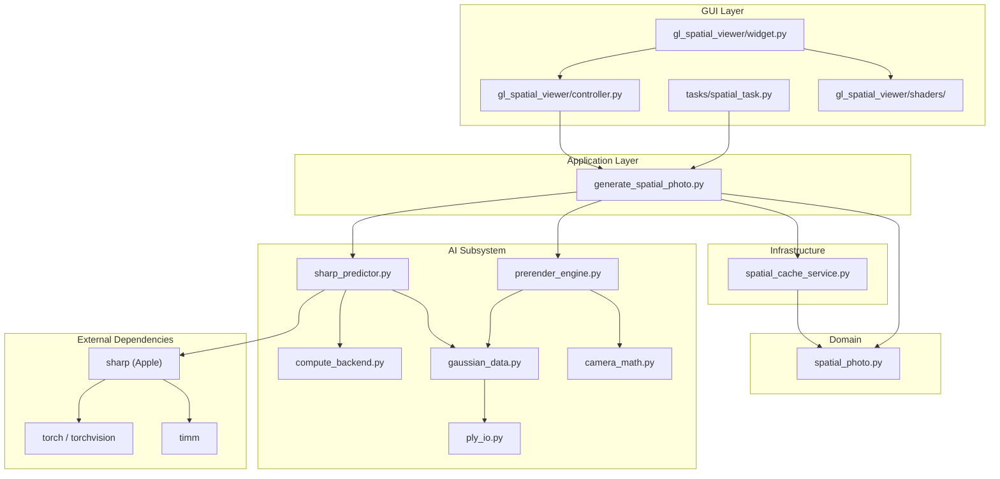
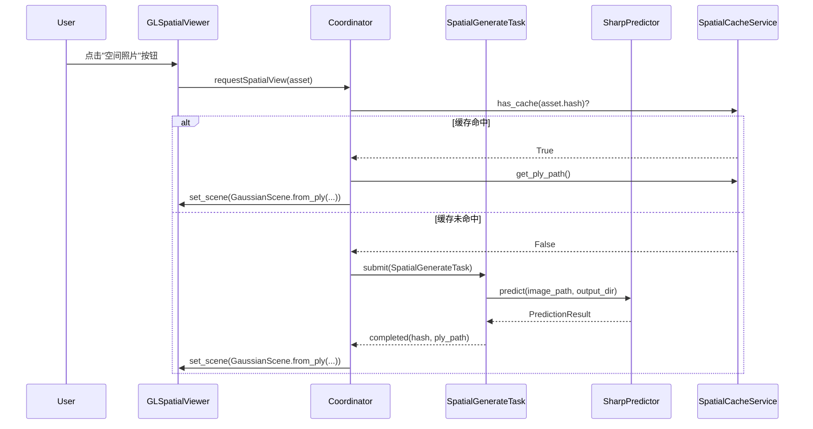
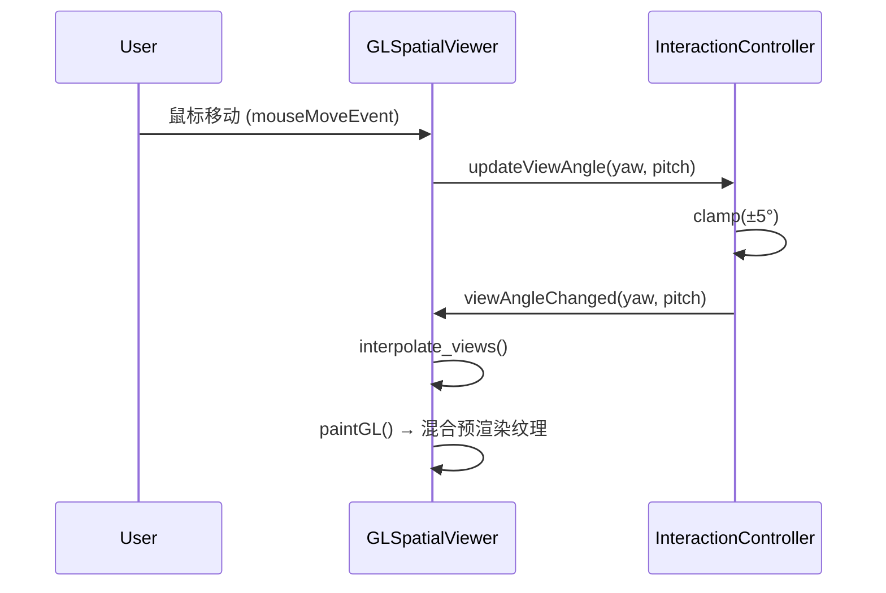

# 🛠️ SHARP 2D→3D 空间照片 — 开发文档

> **版本:** 1.0 · 2026-02-18
>
> 本文档面向开发者，详细描述将 Apple SHARP 模型集成到 iPhotron 中的**实现方案、文件结构、信号流、数据流**，以及关键操作的开发指南。
>
> 前置阅读：[可行性报告](./feasibility_report.md)

---

## 目录

1. [文件结构](#1-文件结构)
2. [模块依赖关系](#2-模块依赖关系)
3. [核心类设计](#3-核心类设计)
   - 3.1 [计算后端抽象](#31-计算后端抽象)
   - 3.2 [SHARP 推理封装](#32-sharp-推理封装)
   - 3.3 [3DGS 数据模型](#33-3dgs-数据模型)
   - 3.4 [OpenGL 3DGS 渲染器](#34-opengl-3dgs-渲染器)
   - 3.5 [预渲染引擎](#35-预渲染引擎)
   - 3.6 [空间照片查看器 Widget](#36-空间照片查看器-widget)
   - 3.7 [缓存管理器](#37-缓存管理器)
   - 3.8 [后台任务 Worker](#38-后台任务-worker)
4. [信号流与事件体系](#4-信号流与事件体系)
5. [数据流](#5-数据流)
   - 5.1 [3DGS 生成流程](#51-3dgs-生成流程)
   - 5.2 [空间照片查看流程](#52-空间照片查看流程)
   - 5.3 [缓存命中流程](#53-缓存命中流程)
6. [OpenGL 3DGS 渲染技术方案](#6-opengl-3dgs-渲染技术方案)
   - 6.1 [Phase 1: 预渲染多角度方案](#61-phase-1-预渲染多角度方案)
   - 6.2 [Phase 2: Fragment Shader 实时渲染](#62-phase-2-fragment-shader-实时渲染)
7. [设备检测与后端选择](#7-设备检测与后端选择)
8. [配置项](#8-配置项)
9. [依赖安装](#9-依赖安装)
10. [数据库设计](#10-数据库设计)
11. [测试策略](#11-测试策略)
12. [开发里程碑](#12-开发里程碑)

---

## 1. 文件结构

以下为新增文件在现有项目结构中的位置，遵循 iPhotron 已有的分层架构（Domain → Application → Infrastructure → GUI）。

```
src/iPhoto/
├── ai/                                       # AI 子系统根目录 (已规划)
│   ├── __init__.py
│   ├── compute_backend.py                    # 通用 GPU/CPU 后端检测 (可与人脸/OCR 共用)
│   │
│   └── spatial/                              # 🆕 空间照片 (2D→3D) 子模块
│       ├── __init__.py
│       ├── config.py                         # 空间照片配置常量
│       ├── sharp_predictor.py                # SHARP 模型推理封装
│       ├── gaussian_data.py                  # 3DGS 数据类定义
│       ├── prerender_engine.py               # 多角度预渲染引擎 (Phase 1)
│       ├── ply_io.py                         # PLY 文件读写 (简化版)
│       └── camera_math.py                    # 相机轨迹 / 投影矩阵计算
│
├── domain/
│   └── models/
│       └── spatial_photo.py                  # 🆕 空间照片领域模型
│
├── application/
│   └── use_cases/
│       └── generate_spatial_photo.py         # 🆕 生成空间照片用例
│
├── infrastructure/
│   └── services/
│       └── spatial_cache_service.py          # 🆕 3DGS 缓存服务
│
├── gui/
│   └── ui/
│       ├── widgets/
│       │   └── gl_spatial_viewer/            # 🆕 空间照片查看器
│       │       ├── __init__.py
│       │       ├── widget.py                 # QOpenGLWidget 子类
│       │       ├── controller.py             # 鼠标交互控制器
│       │       ├── shaders/                  # GLSL 着色器
│       │       │   ├── spatial_vertex.glsl
│       │       │   └── spatial_fragment.glsl
│       │       └── prerender_blender.py      # 预渲染纹理混合器
│       │
│       └── tasks/
│           └── spatial_task.py               # 🆕 后台 3DGS 生成任务
│
└── schemas/
    └── spatial_config.schema.json            # 🆕 空间照片配置 JSON Schema
```

---

## 2. 模块依赖关系



---

## 3. 核心类设计

### 3.1 计算后端抽象

> 与人脸/OCR 子系统共用 `ai/compute_backend.py`

```python
# src/iPhoto/ai/compute_backend.py
from __future__ import annotations

import logging
from dataclasses import dataclass
from enum import Enum

LOGGER = logging.getLogger(__name__)


class DeviceType(Enum):
    """支持的计算设备类型。"""
    CUDA = "cuda"
    MPS = "mps"
    CPU = "cpu"


@dataclass(frozen=True)
class DeviceInfo:
    """设备信息。"""
    device_type: DeviceType
    device_name: str
    vram_mb: int | None  # GPU 显存 (MB), CPU 为 None
    compute_capability: str | None  # CUDA compute capability


def detect_best_device() -> DeviceInfo:
    """检测最佳可用计算设备。

    优先级: CUDA > MPS > CPU
    """
    try:
        import torch

        if torch.cuda.is_available():
            props = torch.cuda.get_device_properties(0)
            return DeviceInfo(
                device_type=DeviceType.CUDA,
                device_name=props.name,
                vram_mb=props.total_mem // (1024 * 1024),
                compute_capability=f"{props.major}.{props.minor}",
            )
        if torch.mps.is_available():
            return DeviceInfo(
                device_type=DeviceType.MPS,
                device_name="Apple Silicon (MPS)",
                vram_mb=None,  # MPS 共享内存
                compute_capability=None,
            )
    except ImportError:
        LOGGER.warning("PyTorch 未安装，回退到 CPU 模式")

    import platform
    return DeviceInfo(
        device_type=DeviceType.CPU,
        device_name=platform.processor() or "Unknown CPU",
        vram_mb=None,
        compute_capability=None,
    )


def get_torch_device(device_info: DeviceInfo) -> "torch.device":
    """将 DeviceInfo 转换为 torch.device。"""
    import torch
    return torch.device(device_info.device_type.value)
```

### 3.2 SHARP 推理封装

```python
# src/iPhoto/ai/spatial/sharp_predictor.py
from __future__ import annotations

import logging
from dataclasses import dataclass
from pathlib import Path

import numpy as np

LOGGER = logging.getLogger(__name__)

MODEL_URL = "https://ml-site.cdn-apple.com/models/sharp/sharp_2572gikvuh.pt"


@dataclass
class PredictionResult:
    """SHARP 推理结果。"""
    gaussians_ply_path: Path      # 生成的 PLY 文件路径
    focal_length_px: float        # 焦距 (像素)
    image_size: tuple[int, int]   # (宽, 高)
    device_used: str              # 使用的设备


class SharpPredictor:
    """SHARP 模型推理封装。

    封装 Apple SHARP 的推理流程，提供简洁的 API：
        predictor = SharpPredictor(device="auto")
        result = predictor.predict(image_path, output_dir)
    """

    def __init__(self, device: str = "auto", checkpoint_path: Path | None = None):
        """初始化 SHARP 预测器。

        Args:
            device: 计算设备, "auto"/"cuda"/"mps"/"cpu"
            checkpoint_path: 自定义模型路径, None 则自动下载
        """
        self._device_str = device
        self._checkpoint_path = checkpoint_path
        self._predictor = None  # 延迟加载
        self._device = None

    def _ensure_loaded(self):
        """延迟加载模型 (首次调用时)。"""
        if self._predictor is not None:
            return

        import torch
        from sharp.models import PredictorParams, create_predictor

        # 设备选择
        if self._device_str == "auto":
            if torch.cuda.is_available():
                self._device = torch.device("cuda")
            elif torch.mps.is_available():
                self._device = torch.device("mps")
            else:
                self._device = torch.device("cpu")
        else:
            self._device = torch.device(self._device_str)

        LOGGER.info("SHARP 使用设备: %s", self._device)

        # 加载 checkpoint
        if self._checkpoint_path is None:
            LOGGER.info("自动下载 SHARP 模型: %s", MODEL_URL)
            state_dict = torch.hub.load_state_dict_from_url(
                MODEL_URL, progress=True
            )
        else:
            state_dict = torch.load(
                self._checkpoint_path, weights_only=True
            )

        self._predictor = create_predictor(PredictorParams())
        self._predictor.load_state_dict(state_dict)
        self._predictor.eval()
        self._predictor.to(self._device)

    def predict(
        self,
        image_path: Path,
        output_dir: Path,
    ) -> PredictionResult:
        """从单张照片生成 3DGS。

        Args:
            image_path: 输入照片路径
            output_dir: PLY 输出目录

        Returns:
            PredictionResult 包含 PLY 路径等信息
        """
        self._ensure_loaded()

        import torch
        import torch.nn.functional as F
        from sharp.utils import io
        from sharp.utils.gaussians import save_ply, unproject_gaussians

        # 加载图片
        image, _, f_px = io.load_rgb(image_path)
        height, width = image.shape[:2]

        # 预处理
        image_pt = (
            torch.from_numpy(image.copy())
            .float()
            .to(self._device)
            .permute(2, 0, 1)
            / 255.0
        )
        internal_shape = (1536, 1536)
        image_resized = F.interpolate(
            image_pt[None],
            size=internal_shape,
            mode="bilinear",
            align_corners=True,
        )
        disparity_factor = (
            torch.tensor([f_px / width]).float().to(self._device)
        )

        # 推理
        with torch.no_grad():
            gaussians_ndc = self._predictor(image_resized, disparity_factor)

        # 后处理: NDC → 度量空间
        intrinsics_resized = torch.tensor(
            [[f_px * internal_shape[0] / width, 0, internal_shape[0] / 2, 0],
             [0, f_px * internal_shape[1] / height, internal_shape[1] / 2, 0],
             [0, 0, 1, 0],
             [0, 0, 0, 1]],
            dtype=torch.float32, device=self._device,
        )
        gaussians = unproject_gaussians(
            gaussians_ndc,
            torch.eye(4, device=self._device),
            intrinsics_resized,
            internal_shape,
        )

        # 保存 PLY
        output_dir.mkdir(parents=True, exist_ok=True)
        ply_path = output_dir / f"{image_path.stem}.ply"
        save_ply(gaussians, f_px, (height, width), ply_path)

        return PredictionResult(
            gaussians_ply_path=ply_path,
            focal_length_px=f_px,
            image_size=(width, height),
            device_used=str(self._device),
        )

    def unload(self):
        """释放模型占用的 GPU/CPU 内存。"""
        if self._predictor is not None:
            del self._predictor
            self._predictor = None
            try:
                import torch
                if self._device and self._device.type == "cuda":
                    torch.cuda.empty_cache()
            except ImportError:
                pass
```

### 3.3 3DGS 数据模型

```python
# src/iPhoto/ai/spatial/gaussian_data.py
from __future__ import annotations

from dataclasses import dataclass

import numpy as np


@dataclass
class GaussianSplat:
    """单个 3D 高斯溅射的参数。"""
    position: np.ndarray       # (3,) xyz 坐标
    color_sh: np.ndarray       # (C,) 球谐函数系数 (颜色)
    opacity: float             # 不透明度 [0, 1]
    scale: np.ndarray          # (3,) 缩放
    rotation: np.ndarray       # (4,) 四元数旋转


@dataclass
class GaussianScene:
    """3DGS 场景 (一组高斯溅射)。"""
    positions: np.ndarray      # (N, 3) 所有高斯的位置
    colors_sh: np.ndarray      # (N, C) 球谐系数
    opacities: np.ndarray      # (N,)   不透明度
    scales: np.ndarray         # (N, 3) 缩放
    rotations: np.ndarray      # (N, 4) 旋转四元数
    focal_length_px: float     # 焦距
    image_size: tuple[int, int]  # (宽, 高)

    @property
    def num_gaussians(self) -> int:
        return len(self.positions)

    @classmethod
    def from_ply(cls, ply_path: str) -> GaussianScene:
        """从 PLY 文件加载 3DGS 场景。"""
        from plyfile import PlyData

        plydata = PlyData.read(ply_path)
        vertex = plydata["vertex"]

        positions = np.stack([
            vertex["x"], vertex["y"], vertex["z"]
        ], axis=-1).astype(np.float32)

        # 提取球谐系数 (至少 f_dc_0, f_dc_1, f_dc_2)
        sh_names = [p.name for p in vertex.properties if p.name.startswith("f_dc")]
        colors_sh = np.stack(
            [vertex[name] for name in sh_names], axis=-1
        ).astype(np.float32)

        opacities = vertex["opacity"].astype(np.float32)

        scales = np.stack([
            vertex["scale_0"], vertex["scale_1"], vertex["scale_2"]
        ], axis=-1).astype(np.float32)

        rotations = np.stack([
            vertex["rot_0"], vertex["rot_1"], vertex["rot_2"], vertex["rot_3"]
        ], axis=-1).astype(np.float32)

        # 从 PLY 头部 comment 中读取元数据
        f_px = 1000.0  # 默认值
        width, height = 1920, 1080
        for comment in plydata.comments:
            if comment.startswith("focal_length_px"):
                f_px = float(comment.split("=")[1].strip())
            elif comment.startswith("image_width"):
                width = int(comment.split("=")[1].strip())
            elif comment.startswith("image_height"):
                height = int(comment.split("=")[1].strip())

        return cls(
            positions=positions,
            colors_sh=colors_sh,
            opacities=opacities,
            scales=scales,
            rotations=rotations,
            focal_length_px=f_px,
            image_size=(width, height),
        )
```

### 3.4 OpenGL 3DGS 渲染器

> Phase 2 实现。基于 iPhotron 现有 OpenGL 管线。

```python
# src/iPhoto/gui/ui/widgets/gl_spatial_viewer/widget.py (概要)
from __future__ import annotations

from PySide6.QtCore import Qt, Signal, QPointF
from PySide6.QtOpenGLWidgets import QOpenGLWidget
from PySide6.QtGui import QMouseEvent

from iPhoto.ai.spatial.gaussian_data import GaussianScene


class GLSpatialViewer(QOpenGLWidget):
    """空间照片查看器 — 基于 OpenGL 的 3DGS 交互式渲染 Widget。

    Phase 1: 使用预渲染纹理混合
    Phase 2: 使用 Fragment Shader 实时 3DGS 渲染
    """

    viewAngleChanged = Signal(float, float)  # (yaw, pitch) 度

    # 视角范围限制 (模拟空间照片的小角度移动)
    MAX_YAW_DEG = 5.0
    MAX_PITCH_DEG = 5.0

    def __init__(self, parent=None):
        super().__init__(parent)
        self._scene: GaussianScene | None = None
        self._yaw = 0.0    # 当前水平视角偏移 (度)
        self._pitch = 0.0  # 当前垂直视角偏移 (度)
        self._prerendered_views: dict[tuple[int, int], "QImage"] = {}
        self.setMouseTracking(True)

    def set_scene(self, scene: GaussianScene):
        """设置要渲染的 3DGS 场景。"""
        self._scene = scene
        self.update()

    def set_prerendered_views(self, views: dict[tuple[int, int], "QImage"]):
        """设置预渲染视图 (Phase 1)。

        Args:
            views: {(yaw_idx, pitch_idx): QImage} 预渲染帧
        """
        self._prerendered_views = views
        self.update()

    def mouseMoveEvent(self, event: QMouseEvent):
        """鼠标移动驱动视角变化。"""
        center = QPointF(self.width() / 2, self.height() / 2)
        pos = event.position()
        # 将鼠标位置映射到 [-MAX, +MAX] 度
        self._yaw = (pos.x() - center.x()) / center.x() * self.MAX_YAW_DEG
        self._pitch = -(pos.y() - center.y()) / center.y() * self.MAX_PITCH_DEG
        # 限幅
        self._yaw = max(-self.MAX_YAW_DEG, min(self.MAX_YAW_DEG, self._yaw))
        self._pitch = max(-self.MAX_PITCH_DEG, min(self.MAX_PITCH_DEG, self._pitch))
        self.viewAngleChanged.emit(self._yaw, self._pitch)
        self.update()

    def initializeGL(self):
        """OpenGL 初始化。"""
        # 复用 iPhotron 已有的 gl_renderer 初始化模式
        from OpenGL import GL
        GL.glClearColor(0.0, 0.0, 0.0, 1.0)
        GL.glEnable(GL.GL_BLEND)
        GL.glBlendFunc(GL.GL_SRC_ALPHA, GL.GL_ONE_MINUS_SRC_ALPHA)

    def paintGL(self):
        """渲染帧。"""
        from OpenGL import GL
        GL.glClear(GL.GL_COLOR_BUFFER_BIT | GL.GL_DEPTH_BUFFER_BIT)

        if self._prerendered_views:
            self._render_prerendered()
        elif self._scene:
            self._render_gaussians_realtime()

    def _render_prerendered(self):
        """Phase 1: 预渲染纹理混合渲染。"""
        # 根据当前 yaw/pitch 在预渲染视图之间插值
        pass  # 实现细节见 Section 6.1

    def _render_gaussians_realtime(self):
        """Phase 2: 实时 3DGS Fragment Shader 渲染。"""
        # 实现细节见 Section 6.2
        pass
```

### 3.5 预渲染引擎

```python
# src/iPhoto/ai/spatial/prerender_engine.py
from __future__ import annotations

import logging
from dataclasses import dataclass
from pathlib import Path

import numpy as np

LOGGER = logging.getLogger(__name__)


@dataclass
class PrerenderConfig:
    """预渲染配置。"""
    yaw_steps: int = 3      # 水平方向步数 (e.g. 3 → -5°, 0°, +5°)
    pitch_steps: int = 3    # 垂直方向步数
    max_yaw_deg: float = 5.0
    max_pitch_deg: float = 5.0
    output_width: int = 1920
    output_height: int = 1080


class PrerenderEngine:
    """多角度预渲染引擎。

    使用 SHARP 的推理结果 (3DGS) 和 PyTorch 渲染多个固定角度的视图，
    供 Phase 1 的纹理插值方案使用。
    """

    def __init__(self, config: PrerenderConfig | None = None):
        self.config = config or PrerenderConfig()

    def render_views(
        self,
        gaussians,  # sharp Gaussians3D
        focal_length_px: float,
        image_size: tuple[int, int],
        output_dir: Path,
    ) -> dict[tuple[int, int], Path]:
        """渲染多角度视图。

        Args:
            gaussians: SHARP 生成的 3DGS
            focal_length_px: 焦距
            image_size: (宽, 高)
            output_dir: 输出目录

        Returns:
            {(yaw_idx, pitch_idx): image_path} 映射
        """
        import torch
        from iPhoto.ai.spatial.camera_math import compute_view_matrix

        width, height = image_size
        view_map: dict[tuple[int, int], Path] = {}

        yaw_angles = np.linspace(
            -self.config.max_yaw_deg,
            self.config.max_yaw_deg,
            self.config.yaw_steps,
        )
        pitch_angles = np.linspace(
            -self.config.max_pitch_deg,
            self.config.max_pitch_deg,
            self.config.pitch_steps,
        )

        output_dir.mkdir(parents=True, exist_ok=True)

        for yi, yaw in enumerate(yaw_angles):
            for pi, pitch in enumerate(pitch_angles):
                view_matrix = compute_view_matrix(
                    yaw_deg=yaw,
                    pitch_deg=pitch,
                    focal_length_px=focal_length_px,
                    image_size=image_size,
                )

                # 使用 PyTorch 软件渲染 (不依赖 CUDA gsplat)
                rendered = self._render_single_view(
                    gaussians, view_matrix, focal_length_px, image_size
                )

                # 保存为 PNG
                from PIL import Image
                frame_path = output_dir / f"view_{yi}_{pi}.png"
                Image.fromarray(rendered).save(frame_path)
                view_map[(yi, pi)] = frame_path

                LOGGER.debug(
                    "预渲染: yaw=%.1f° pitch=%.1f° → %s",
                    yaw, pitch, frame_path,
                )

        return view_map

    def _render_single_view(
        self,
        gaussians,
        view_matrix: np.ndarray,
        focal_length_px: float,
        image_size: tuple[int, int],
    ) -> np.ndarray:
        """使用 PyTorch CPU/GPU 渲染单个视角。

        不依赖 gsplat，使用基础的高斯溅射排序+Alpha合成。

        Returns:
            (H, W, 3) uint8 numpy 数组
        """
        import torch

        width, height = image_size
        device = gaussians.means.device

        # 简化版渲染: 将 3D 高斯投影到 2D, 按深度排序, Alpha 合成
        # 此处为示意; 实际实现需要完整的 splatting 算法
        canvas = np.zeros((height, width, 3), dtype=np.uint8)

        # TODO: 实现基于 PyTorch 的软件 3DGS 渲染器
        # 可参考 diff-gaussian-rasterization 的纯 Python 实现

        return canvas
```

### 3.6 相机数学

```python
# src/iPhoto/ai/spatial/camera_math.py
from __future__ import annotations

import math

import numpy as np


def compute_view_matrix(
    yaw_deg: float,
    pitch_deg: float,
    focal_length_px: float,
    image_size: tuple[int, int],
    distance: float = 1.0,
) -> np.ndarray:
    """计算给定偏转角的 4×4 视图矩阵。

    坐标系遵循 OpenCV 惯例 (x 右, y 下, z 前)。

    Args:
        yaw_deg: 水平偏转角 (度), 正值向右
        pitch_deg: 垂直偏转角 (度), 正值向上
        focal_length_px: 焦距 (像素)
        image_size: (宽, 高) 像素
        distance: 相机到场景中心的距离

    Returns:
        4×4 float32 视图矩阵
    """
    yaw = math.radians(yaw_deg)
    pitch = math.radians(pitch_deg)

    # 旋转矩阵: 先 pitch (绕 x), 再 yaw (绕 y)
    cy, sy = math.cos(yaw), math.sin(yaw)
    cp, sp = math.cos(pitch), math.sin(pitch)

    R = np.array([
        [cy, 0, sy],
        [sp * sy, cp, -sp * cy],
        [-cp * sy, sp, cp * cy],
    ], dtype=np.float32)

    # 平移: 沿视线方向后退 distance
    t = np.array([0, 0, distance], dtype=np.float32)

    view = np.eye(4, dtype=np.float32)
    view[:3, :3] = R
    view[:3, 3] = -R @ t

    return view


def compute_intrinsics(
    focal_length_px: float,
    image_size: tuple[int, int],
) -> np.ndarray:
    """计算 4×4 内参矩阵。"""
    w, h = image_size
    return np.array([
        [focal_length_px, 0, (w - 1) / 2.0, 0],
        [0, focal_length_px, (h - 1) / 2.0, 0],
        [0, 0, 1, 0],
        [0, 0, 0, 1],
    ], dtype=np.float32)


def interpolate_views(
    yaw: float, pitch: float,
    max_yaw: float, max_pitch: float,
    yaw_steps: int, pitch_steps: int,
) -> list[tuple[tuple[int, int], float]]:
    """计算当前视角对应的预渲染视图插值权重。

    使用双线性插值在最近的 4 个预渲染视图之间混合。

    Args:
        yaw: 当前水平角度 (度)
        pitch: 当前垂直角度 (度)
        max_yaw/max_pitch: 最大角度范围
        yaw_steps/pitch_steps: 预渲染步数

    Returns:
        [((yaw_idx, pitch_idx), weight), ...] 最多 4 个视图及其权重
    """
    # 将角度映射到网格索引 (浮点)
    yi_f = (yaw + max_yaw) / (2 * max_yaw) * (yaw_steps - 1)
    pi_f = (pitch + max_pitch) / (2 * max_pitch) * (pitch_steps - 1)

    # 限幅
    yi_f = max(0, min(yaw_steps - 1, yi_f))
    pi_f = max(0, min(pitch_steps - 1, pi_f))

    # 双线性插值的 4 个角点
    yi0 = int(math.floor(yi_f))
    yi1 = min(yi0 + 1, yaw_steps - 1)
    pi0 = int(math.floor(pi_f))
    pi1 = min(pi0 + 1, pitch_steps - 1)

    fy = yi_f - yi0
    fp = pi_f - pi0

    weights = [
        ((yi0, pi0), (1 - fy) * (1 - fp)),
        ((yi1, pi0), fy * (1 - fp)),
        ((yi0, pi1), (1 - fy) * fp),
        ((yi1, pi1), fy * fp),
    ]

    return [(idx, w) for idx, w in weights if w > 1e-6]
```

### 3.7 缓存管理器

```python
# src/iPhoto/infrastructure/services/spatial_cache_service.py
from __future__ import annotations

import logging
from dataclasses import dataclass
from pathlib import Path

LOGGER = logging.getLogger(__name__)


@dataclass
class SpatialCacheEntry:
    """空间照片缓存条目。"""
    asset_hash: str                     # 原始照片的 xxhash
    ply_path: Path                      # 3DGS PLY 文件路径
    prerender_dir: Path | None          # 预渲染视图目录
    focal_length_px: float
    image_size: tuple[int, int]
    created_at: str                     # ISO 8601 时间戳


class SpatialCacheService:
    """3DGS 缓存管理。

    缓存目录结构:
        {album_path}/.iphoto_spatial/
        ├── {asset_hash}.ply              # 3DGS 文件
        └── {asset_hash}_views/           # 预渲染视图
            ├── view_0_0.png
            ├── view_0_1.png
            └── ...
    """

    CACHE_DIR_NAME = ".iphoto_spatial"

    def __init__(self, album_path: Path):
        self._album_path = album_path
        self._cache_dir = album_path / self.CACHE_DIR_NAME

    def has_cache(self, asset_hash: str) -> bool:
        """检查是否已有缓存。"""
        return (self._cache_dir / f"{asset_hash}.ply").exists()

    def get_ply_path(self, asset_hash: str) -> Path:
        """获取 PLY 缓存路径。"""
        return self._cache_dir / f"{asset_hash}.ply"

    def get_prerender_dir(self, asset_hash: str) -> Path:
        """获取预渲染视图目录。"""
        return self._cache_dir / f"{asset_hash}_views"

    def clear_cache(self, asset_hash: str | None = None):
        """清除缓存。

        Args:
            asset_hash: 指定则仅清除该资产缓存, None 清除全部
        """
        import shutil

        if asset_hash:
            ply = self._cache_dir / f"{asset_hash}.ply"
            views_dir = self._cache_dir / f"{asset_hash}_views"
            if ply.exists():
                ply.unlink()
            if views_dir.exists():
                shutil.rmtree(views_dir)
        else:
            if self._cache_dir.exists():
                shutil.rmtree(self._cache_dir)

    def cache_size_bytes(self) -> int:
        """获取缓存总大小 (字节)。"""
        if not self._cache_dir.exists():
            return 0
        return sum(f.stat().st_size for f in self._cache_dir.rglob("*") if f.is_file())
```

### 3.8 后台任务 Worker

```python
# src/iPhoto/gui/ui/tasks/spatial_task.py
from __future__ import annotations

import logging
from pathlib import Path

from PySide6.QtCore import QObject, QRunnable, Signal, Slot

LOGGER = logging.getLogger(__name__)


class SpatialTaskSignals(QObject):
    """空间照片生成任务信号。"""
    started = Signal(str)               # asset_hash
    progress = Signal(str, int)         # asset_hash, 进度百分比
    completed = Signal(str, str)        # asset_hash, ply_path
    error = Signal(str, str)            # asset_hash, error_message


class SpatialGenerateTask(QRunnable):
    """后台 3DGS 生成任务。

    遵循 iPhotron 已有的 QRunnable 任务模式。
    """

    def __init__(
        self,
        image_path: Path,
        asset_hash: str,
        output_dir: Path,
        device: str = "auto",
        prerender: bool = True,
    ):
        super().__init__()
        self.signals = SpatialTaskSignals()
        self._image_path = image_path
        self._asset_hash = asset_hash
        self._output_dir = output_dir
        self._device = device
        self._prerender = prerender
        self.setAutoDelete(True)

    @Slot()
    def run(self):
        """执行 3DGS 生成。"""
        try:
            self.signals.started.emit(self._asset_hash)
            self.signals.progress.emit(self._asset_hash, 10)

            # Step 1: SHARP 推理
            from iPhoto.ai.spatial.sharp_predictor import SharpPredictor

            predictor = SharpPredictor(device=self._device)
            self.signals.progress.emit(self._asset_hash, 30)

            result = predictor.predict(self._image_path, self._output_dir)
            self.signals.progress.emit(self._asset_hash, 70)

            # Step 2: 预渲染 (可选)
            if self._prerender:
                from iPhoto.ai.spatial.prerender_engine import PrerenderEngine

                engine = PrerenderEngine()
                # 预渲染需要 SHARP 的 Gaussians3D 对象
                # 此处简化, 实际需要从 PLY 重新加载
                self.signals.progress.emit(self._asset_hash, 90)

            # 释放模型内存
            predictor.unload()

            self.signals.progress.emit(self._asset_hash, 100)
            self.signals.completed.emit(
                self._asset_hash, str(result.gaussians_ply_path)
            )

        except ImportError as e:
            self.signals.error.emit(
                self._asset_hash,
                f"缺少 3D 功能依赖，请运行: pip install iPhoto[3d]\n{e}",
            )
        except Exception as e:
            LOGGER.exception("空间照片生成失败: %s", self._image_path)
            self.signals.error.emit(self._asset_hash, str(e))
```

---

## 4. 信号流与事件体系

### 4.1 3DGS 生成信号流



### 4.2 实时视角交互信号流



---

## 5. 数据流

### 5.1 3DGS 生成流程

```
输入照片 (HEIC/JPG/PNG)
    │
    ▼
┌─────────────────────────────┐
│  io.load_rgb()              │  ← SHARP 图像加载 (支持 HEIF)
│  → (H×W×3 uint8, f_px)     │
└────────────┬────────────────┘
             │
             ▼
┌─────────────────────────────┐
│  SharpPredictor.predict()   │
│  ├── 预处理: resize 1536²    │
│  ├── 推理: predictor()       │  ← PyTorch forward pass
│  └── 后处理: unproject       │     (CUDA/MPS/CPU)
└────────────┬────────────────┘
             │  Gaussians3D
             ▼
┌─────────────────────────────┐
│  save_ply()                 │  ← 保存 3DGS 为 PLY 文件
│  → .iphoto_spatial/xxx.ply  │     (~10-50 MB)
└────────────┬────────────────┘
             │
             ▼
┌─────────────────────────────┐
│  PrerenderEngine (可选)      │
│  ├── 计算 3×3 视角矩阵       │
│  ├── 渲染 9 帧              │  ← PyTorch 软件渲染
│  └── 保存为 PNG             │
└────────────┬────────────────┘
             │
             ▼
  缓存至 .iphoto_spatial/
```

### 5.2 空间照片查看流程

```
用户移动鼠标
    │
    ▼
┌─────────────────────────────┐
│  mouseMoveEvent()           │
│  → (yaw: -5°~+5°,          │
│     pitch: -5°~+5°)        │
└────────────┬────────────────┘
             │
             ▼
┌─────────────────────────────┐
│  interpolate_views()        │
│  → 双线性插值权重            │
│  → [(view_idx, weight), ...]│
└────────────┬────────────────┘
             │
             ▼
┌─────────────────────────────┐
│  paintGL()                  │
│  ├── 加载近邻纹理到 GPU      │
│  ├── Fragment Shader 混合    │
│  └── 输出到屏幕             │
└─────────────────────────────┘
```

### 5.3 缓存命中流程

```
请求空间照片 (asset_hash)
    │
    ▼
┌─────────────────────────────┐
│  SpatialCacheService        │
│  .has_cache(hash)?          │
└──────┬──────────┬───────────┘
       │          │
    命中 ✅    未命中 ❌
       │          │
       ▼          ▼
  加载 PLY    提交生成任务
  + 预渲染     → 后台 Worker
  视图         → 完成后缓存
```

---

## 6. OpenGL 3DGS 渲染技术方案

### 6.1 Phase 1: 预渲染多角度方案

**原理**: 预先渲染有限数量的视角帧，运行时根据鼠标位置进行纹理插值。

**实现步骤**:

1. **预渲染阶段** (后台异步):
   - 从 3DGS 生成 3×3 = 9 个固定视角的 2D 图片
   - 视角范围: yaw ∈ {-5°, 0°, +5°}, pitch ∈ {-5°, 0°, +5°}
   - 使用 PyTorch CPU/GPU 渲染 (不依赖 gsplat)

2. **运行时渲染** (OpenGL):
   ```glsl
   // spatial_fragment.glsl — 预渲染纹理混合
   #version 330 core

   uniform sampler2D view_tl;  // 左上视角
   uniform sampler2D view_tr;  // 右上视角
   uniform sampler2D view_bl;  // 左下视角
   uniform sampler2D view_br;  // 右下视角
   uniform float weight_x;     // 水平插值权重 [0, 1]
   uniform float weight_y;     // 垂直插值权重 [0, 1]

   in vec2 frag_uv;
   out vec4 out_color;

   void main() {
       vec4 top = mix(
           texture(view_tl, frag_uv),
           texture(view_tr, frag_uv),
           weight_x
       );
       vec4 bottom = mix(
           texture(view_bl, frag_uv),
           texture(view_br, frag_uv),
           weight_x
       );
       out_color = mix(top, bottom, weight_y);
   }
   ```

3. **优缺点**:
   - ✅ 实现简单，兼容所有 OpenGL 3.3 设备
   - ✅ 运行时性能极高 (仅纹理采样)
   - ✅ 不依赖 CUDA
   - ❌ 视角精度受限于预渲染步数
   - ❌ 插值可能产生轻微模糊
   - ❌ 预渲染需要额外时间和存储空间

### 6.2 Phase 2: Fragment Shader 实时渲染

**原理**: 在 Fragment Shader 中实现 3DGS 的投影、排序和 Alpha 合成。

**核心算法**:

1. **高斯投影**: 将 3D 高斯中心投影到 2D 屏幕空间
2. **协方差投影**: 计算 2D 高斯的协方差矩阵
3. **深度排序**: 按 Z 值排序（前到后）
4. **Alpha 合成**: 按顺序混合每个高斯的颜色贡献

**GLSL 实现概要**:

```glsl
// gaussian_vertex.glsl
#version 330 core

uniform mat4 view_matrix;
uniform mat4 proj_matrix;

layout(location = 0) in vec3 gaussian_center;    // 3D 位置
layout(location = 1) in vec3 gaussian_color;     // RGB 颜色
layout(location = 2) in float gaussian_opacity;  // 不透明度
layout(location = 3) in vec3 gaussian_scale;     // 缩放
layout(location = 4) in vec4 gaussian_rotation;  // 四元数

out vec3 v_color;
out float v_opacity;
out vec2 v_offset;     // 片段到高斯中心的偏移
out mat2 v_cov2d_inv;  // 2D 协方差逆矩阵

void main() {
    // 1. 投影到相机空间
    vec4 cam_pos = view_matrix * vec4(gaussian_center, 1.0);

    // 2. 计算 2D 协方差 (从 3D 协方差投影)
    // ... (涉及雅可比矩阵计算)

    // 3. 设置 billboard quad 顶点
    gl_Position = proj_matrix * cam_pos;

    v_color = gaussian_color;
    v_opacity = gaussian_opacity;
}
```

```glsl
// gaussian_fragment.glsl
#version 330 core

in vec3 v_color;
in float v_opacity;
in vec2 v_offset;
in mat2 v_cov2d_inv;

out vec4 out_color;

void main() {
    // 计算高斯权重
    float power = -0.5 * dot(v_offset, v_cov2d_inv * v_offset);
    float alpha = v_opacity * exp(power);

    if (alpha < 1.0 / 255.0) discard;

    out_color = vec4(v_color * alpha, alpha);
}
```

---

## 7. 设备检测与后端选择

### 7.1 自动设备选择逻辑

```python
def select_spatial_device() -> str:
    """选择空间照片功能的最佳计算设备。"""
    try:
        import torch
    except ImportError:
        raise RuntimeError("3D 功能需要 PyTorch，请运行: pip install iPhoto[3d]")

    if torch.cuda.is_available():
        # 检查显存是否充足 (推荐 ≥ 4GB)
        vram = torch.cuda.get_device_properties(0).total_mem
        if vram >= 4 * 1024**3:
            return "cuda"
        else:
            # 显存不足, 回退到 CPU
            return "cpu"

    if torch.mps.is_available():
        return "mps"

    return "cpu"
```

### 7.2 降级策略

```
CUDA GPU (≥4GB VRAM)     → SHARP 推理 + 实时 3DGS 渲染
    ↓ 不可用
MPS (Apple Silicon)      → SHARP 推理 + 预渲染方案
    ↓ 不可用
CPU (≥16GB RAM)          → SHARP 推理 (慢) + 预渲染方案
    ↓ 内存不足
CPU (<16GB RAM)          → 禁用 3D 功能, 显示提示
```

---

## 8. 配置项

### 8.1 空间照片配置

```python
# src/iPhoto/ai/spatial/config.py

from dataclasses import dataclass, field


@dataclass
class SpatialConfig:
    """空间照片子系统配置。"""

    # 推理设备
    device: str = "auto"                   # "auto" / "cuda" / "mps" / "cpu"

    # 视角范围
    max_yaw_deg: float = 5.0              # 最大水平偏转角
    max_pitch_deg: float = 5.0            # 最大垂直偏转角

    # 预渲染
    prerender_yaw_steps: int = 5          # 水平预渲染步数
    prerender_pitch_steps: int = 5        # 垂直预渲染步数
    prerender_resolution_scale: float = 1.0  # 预渲染分辨率倍率

    # 缓存
    max_cache_size_mb: int = 5000         # 最大缓存大小 (MB)
    auto_generate: bool = False           # 是否自动为所有照片生成 3DGS

    # 模型
    checkpoint_path: str | None = None    # 自定义模型路径
    model_url: str = (
        "https://ml-site.cdn-apple.com/models/sharp/sharp_2572gikvuh.pt"
    )

    # 性能
    batch_size: int = 1                   # 批处理大小
    num_workers: int = 1                  # 后台 Worker 数量
```

### 8.2 JSON Schema

```json
{
  "$schema": "http://json-schema.org/draft-07/schema#",
  "title": "iPhotron Spatial Photo Config",
  "type": "object",
  "properties": {
    "device": {
      "type": "string",
      "enum": ["auto", "cuda", "mps", "cpu"],
      "default": "auto"
    },
    "max_yaw_deg": {
      "type": "number",
      "minimum": 1.0,
      "maximum": 15.0,
      "default": 5.0
    },
    "max_pitch_deg": {
      "type": "number",
      "minimum": 1.0,
      "maximum": 15.0,
      "default": 5.0
    },
    "prerender_yaw_steps": {
      "type": "integer",
      "minimum": 3,
      "maximum": 11,
      "default": 5
    },
    "prerender_pitch_steps": {
      "type": "integer",
      "minimum": 3,
      "maximum": 11,
      "default": 5
    },
    "max_cache_size_mb": {
      "type": "integer",
      "minimum": 100,
      "default": 5000
    }
  }
}
```

---

## 9. 依赖安装

### 9.1 pyproject.toml 新增配置

```toml
[project.optional-dependencies]
# ... 现有配置 ...

# 3D 空间照片功能 (基础, 自动选择 PyTorch 版本)
3d = [
    "torch>=2.1",
    "torchvision>=0.16",
    "timm>=1.0",
    "plyfile>=1.0",
    "scipy>=1.10",
    "sharp @ git+https://github.com/apple/ml-sharp.git",
]

# 3D 功能 + CUDA 加速
3d-cuda = [
    "iPhoto[3d]",
    # CUDA 版本的 torch 由用户通过 --index-url 指定
]

# 3D 功能 (仅 CPU, 最小体积)
3d-cpu = [
    "torch>=2.1",
    "torchvision>=0.16",
    "timm>=1.0",
    "plyfile>=1.0",
    "scipy>=1.10",
    "sharp @ git+https://github.com/apple/ml-sharp.git",
]
```

### 9.2 安装命令

```bash
# CPU 版本 (最小体积, 适用于所有平台)
pip install iPhoto[3d-cpu] \
    --extra-index-url https://download.pytorch.org/whl/cpu

# CUDA 12.x 版本 (NVIDIA GPU)
pip install iPhoto[3d] \
    --extra-index-url https://download.pytorch.org/whl/cu121

# macOS Apple Silicon (MPS 自动支持)
pip install iPhoto[3d]

# 开发版本 (包含测试工具)
pip install iPhoto[3d,dev]
```

---

## 10. 数据库设计

空间照片元数据存入独立的 SQLite 数据库，遵循 iPhotron 的**非侵入**设计原则。

### 10.1 数据库文件

```
{album_path}/.iphoto_spatial/
├── spatial_index.db          # 元数据数据库
├── {hash1}.ply               # 3DGS 文件
├── {hash1}_views/            # 预渲染视图
└── ...
```

### 10.2 表结构

```sql
-- spatial_index.db

CREATE TABLE IF NOT EXISTS spatial_assets (
    id              INTEGER PRIMARY KEY AUTOINCREMENT,
    asset_hash      TEXT    NOT NULL UNIQUE,     -- 原始照片 xxhash
    asset_path      TEXT    NOT NULL,            -- 原始照片路径
    ply_path        TEXT    NOT NULL,            -- PLY 文件路径
    focal_length_px REAL    NOT NULL,            -- 焦距 (像素)
    image_width     INTEGER NOT NULL,
    image_height    INTEGER NOT NULL,
    num_gaussians   INTEGER NOT NULL,            -- 高斯数量
    ply_size_bytes  INTEGER NOT NULL,            -- PLY 文件大小
    device_used     TEXT    NOT NULL,            -- 推理设备
    inference_time_s REAL,                       -- 推理耗时 (秒)
    has_prerender   INTEGER NOT NULL DEFAULT 0,  -- 是否已预渲染
    created_at      TEXT    NOT NULL DEFAULT (datetime('now')),
    updated_at      TEXT    NOT NULL DEFAULT (datetime('now'))
);

CREATE INDEX idx_spatial_hash ON spatial_assets(asset_hash);

CREATE TABLE IF NOT EXISTS spatial_prerender_views (
    id              INTEGER PRIMARY KEY AUTOINCREMENT,
    spatial_id      INTEGER NOT NULL REFERENCES spatial_assets(id) ON DELETE CASCADE,
    yaw_idx         INTEGER NOT NULL,
    pitch_idx       INTEGER NOT NULL,
    yaw_deg         REAL    NOT NULL,
    pitch_deg       REAL    NOT NULL,
    image_path      TEXT    NOT NULL,
    UNIQUE(spatial_id, yaw_idx, pitch_idx)
);
```

---

## 11. 测试策略

### 11.1 单元测试

| 模块 | 测试内容 | mock 策略 |
|------|---------|-----------|
| `camera_math.py` | 视图矩阵计算、插值权重 | 无需 mock |
| `gaussian_data.py` | PLY 加载/解析 | 使用小型测试 PLY 文件 |
| `config.py` | 配置加载/验证 | 无需 mock |
| `spatial_cache_service.py` | 缓存 CRUD | 临时目录 |

### 11.2 集成测试

| 测试场景 | 依赖 | 策略 |
|----------|------|------|
| SHARP 推理 E2E | PyTorch + SHARP | 标记 `@pytest.mark.slow`，CI 可选跳过 |
| OpenGL 渲染 | GPU/Mesa | 使用 `pytest-qt` + offscreen rendering |
| 缓存流程 | 文件系统 | 使用 `tmp_path` fixture |

### 11.3 测试文件结构

```
tests/
└── ai/
    └── spatial/
        ├── test_camera_math.py
        ├── test_gaussian_data.py
        ├── test_spatial_cache.py
        ├── test_sharp_predictor.py      # @pytest.mark.slow
        ├── test_prerender_engine.py     # @pytest.mark.slow
        └── fixtures/
            └── test_gaussians.ply       # 小型测试 PLY (100 高斯)
```

---

## 12. 开发里程碑

### Phase 1 — MVP (2-3 周)

| 周 | 任务 | 产出 |
|----|------|------|
| W1 | 搭建 `ai/spatial/` 模块骨架 | 文件结构 + 配置 |
| W1 | 实现 `SharpPredictor` | 可从照片生成 PLY |
| W1 | 实现 `SpatialCacheService` | 缓存管理 |
| W2 | 实现 `camera_math.py` + `prerender_engine.py` | 多角度预渲染 |
| W2 | 实现 `GLSpatialViewer` (预渲染模式) | 基础交互查看器 |
| W3 | 实现 `SpatialGenerateTask` | 后台异步生成 |
| W3 | 集成到主界面 + 添加"空间照片"按钮 | 端到端可用 |

### Phase 2 — 增强 (3-4 周)

| 周 | 任务 | 产出 |
|----|------|------|
| W4 | OpenGL Fragment Shader 3DGS 渲染器 | 实时渲染 |
| W5 | 鼠标/触控板交互优化 | 流畅的视差效果 |
| W6 | 设置面板 (设备/质量/缓存) | 用户可配置 |
| W7 | 多平台测试 (Windows/macOS) | 兼容性验证 |

### Phase 3 — 优化 (2-3 周)

| 周 | 任务 | 产出 |
|----|------|------|
| W8 | 模型量化 / ONNX Runtime | 推理加速 |
| W9 | 渲染 LOD + 视锥裁剪 | 渲染性能提升 |
| W10 | 打包 + 用户文档 | 可分发版本 |
